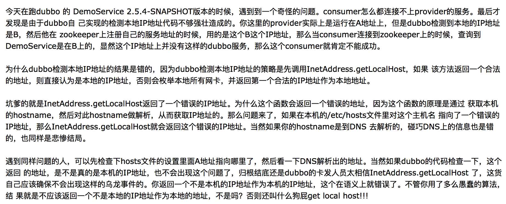
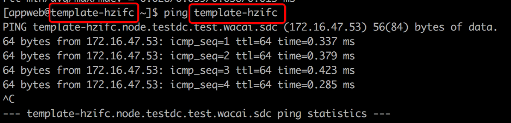

Dubbo服务注册的地址与实际部署的机器地址不一样
=========================
> 2017-11-01


## 1.认识问题
某同学反馈，在部署应用的时候发现了一个问题，我在`172.16.47.59`上面部署了一个应用，部署完结果在注册中心显示这个服务显示在IP不是在实际部署的机器上，
之前我没清理dubbo的cache文件显示在172.16.50.196，我清理缓存以后显示在 `172.16.47.53` 上面，这个问题怎么解决呢？

### 异常信息
根据金稞的反馈，去这台机器check了相关信息，情况属实。

* Dubbo服务器IP确实是`172.16.47.53`，但通过`ifconfig`查看到机器IP是 `172.16.47.59`。
* 服务注册IP与Dubbo服务器IP一样，也是`172.16.47.53`。


## 2.分析问题
通过 Google 和 /dubbo/issues 找到了该问题的解决思路：
* [坑爹的InetAddress getLocalHost函数](http://www.cnblogs.com/jizhao/p/4081675.html)



* ping $hostname返回的IP确实是`172.16.47.53`



* 【dubbo-issues-313】[dubbo-2.5.3 dubbo服务启动的主机与zk集群环境同处于一个网络中，服务端日志频现如下日志](https://github.com/alibaba/dubbo/issues/313)

基于上述分析，**问题根源**：`机器的 hostname 正好与DNS某域名命名相同，映射的IP地址不是机器实际的IP地址`。

#### 服务注册相关源码
服务注册：com.alibaba.dubbo.registry.integration.RegistryProtocol
```java
    private <T> Invoker<T> doRefer(Cluster cluster, Registry registry, Class<T> type, URL url) {
        RegistryDirectory<T> directory = new RegistryDirectory<T>(type, url);
        directory.setRegistry(registry);
        directory.setProtocol(protocol);
        // 这里获取本地网卡地址NetUtils.getLocalHost()
        URL subscribeUrl = new URL(Constants.CONSUMER_PROTOCOL, NetUtils.getLocalHost(), 0, type.getName(), directory.getUrl().getParameters());
        if (! Constants.ANY_VALUE.equals(url.getServiceInterface())
                && url.getParameter(Constants.REGISTER_KEY, true)) {
            registry.register(subscribeUrl.addParameters(Constants.CATEGORY_KEY, Constants.CONSUMERS_CATEGORY,
                    Constants.CHECK_KEY, String.valueOf(false)));
        }
        directory.subscribe(subscribeUrl.addParameter(Constants.CATEGORY_KEY,
                Constants.PROVIDERS_CATEGORY
                + "," + Constants.CONFIGURATORS_CATEGORY
                + "," + Constants.ROUTERS_CATEGORY));
        return cluster.join(directory);
    }
```

获取本地主机地址：com.alibaba.dubbo.common.utils.NetUtils
```java
    public static String getLocalHost(){
        InetAddress address = getLocalAddress();
        return address == null ? LOCALHOST : address.getHostAddress();
    }

    /**
     * 遍历本地网卡，返回第一个合理的IP。
     *
     * @return 本地网卡IP
     */
    public static InetAddress getLocalAddress() {
        if (LOCAL_ADDRESS != null)
            return LOCAL_ADDRESS;
        InetAddress localAddress = getLocalAddress0();
        LOCAL_ADDRESS = localAddress;
        return localAddress;
    }

    private static InetAddress getLocalAddress0() {
        InetAddress localAddress = null;
        try {
            localAddress = InetAddress.getLocalHost();
            if (isValidAddress(localAddress)) {
                return localAddress;
            }
        } catch (Throwable e) {
            logger.warn("Failed to retriving ip address, " + e.getMessage(), e);
        }
        try {
            Enumeration<NetworkInterface> interfaces = NetworkInterface.getNetworkInterfaces();
            if (interfaces != null) {
                while (interfaces.hasMoreElements()) {
                    try {
                        NetworkInterface network = interfaces.nextElement();
                        Enumeration<InetAddress> addresses = network.getInetAddresses();
                        if (addresses != null) {
                            while (addresses.hasMoreElements()) {
                                try {
                                    InetAddress address = addresses.nextElement();
                                    if (isValidAddress(address)) {
                                        return address;
                                    }
                                } catch (Throwable e) {
                                    logger.warn("Failed to retriving ip address, " + e.getMessage(), e);
                                }
                            }
                        }
                    } catch (Throwable e) {
                        logger.warn("Failed to retriving ip address, " + e.getMessage(), e);
                    }
                }
            }
        } catch (Throwable e) {
            logger.warn("Failed to retriving ip address, " + e.getMessage(), e);
        }
        logger.error("Could not get local host ip address, will use 127.0.0.1 instead.");
        return localAddress;
    }
```


## 3.解决问题
1. 修改 `hostname`
2. 在 `/etc/hosts` 中配置 hostname -> 本机IP地址

```sh
[appweb@web-47-59-hzifc ~]$ hostname
web-47-59-hzifc

$ ping web-47-59-hzifc
PING web-47-59-hzifc (172.16.47.59) 56(84) bytes of data.

$ ifconfig
eth0      Link encap:Ethernet  HWaddr 02:00:AC:10:2F:3B
          inet addr:172.16.47.59  Bcast:172.16.47.255  Mask:255.255.255.0

$ vim /etc/hosts
172.16.47.59 web-47-59-hzifc web-47-59-hzifc
```


### 改进方式
dubbo-2.5.6 已经调整了服务注册实现逻辑，建议升级到最新的稳定版。

com.alibaba.dubbo.registry.integration.RegistryProtocol
```java
    private <T> Invoker<T> doRefer(Cluster cluster, Registry registry, Class<T> type, URL url) {
        RegistryDirectory<T> directory = new RegistryDirectory<T>(type, url);
        directory.setRegistry(registry);
        directory.setProtocol(protocol);
        // REFER_KEY的所有属性
        Map<String, String> parameters = new HashMap<String, String>(directory.getUrl().getParameters());
        URL subscribeUrl = new URL(Constants.CONSUMER_PROTOCOL, parameters.remove(Constants.REGISTER_IP_KEY), 0, type.getName(), parameters);
        if (!Constants.ANY_VALUE.equals(url.getServiceInterface())
                && url.getParameter(Constants.REGISTER_KEY, true)) {
            registry.register(subscribeUrl.addParameters(Constants.CATEGORY_KEY, Constants.CONSUMERS_CATEGORY,
                    Constants.CHECK_KEY, String.valueOf(false)));
        }
        directory.subscribe(subscribeUrl.addParameter(Constants.CATEGORY_KEY,
                Constants.PROVIDERS_CATEGORY
                        + "," + Constants.CONFIGURATORS_CATEGORY
                        + "," + Constants.ROUTERS_CATEGORY));
        return cluster.join(directory);
    }
```

