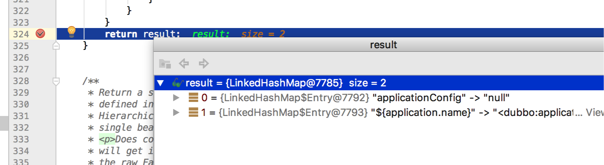

Dubbo应用升级后报服务引用组件的应用配置NPE异常
===========================
> 2017-11-22


## 1.认识问题
某同学反馈：将某应用接入`xxx-boot-starter`时，只修改了POM依赖，报如下异常。
```
Caused by: java.lang.NullPointerException
	at com.alibaba.dubbo.config.spring.ReferenceBean.afterPropertiesSet(ReferenceBean.java:102)
	...
```

他通过debug到抛出NPE异常的代码语句(ReferenceBean.java:102)，看到的现象：


### 异常日志
```
# DubboProperties 和 DubboAutoConfiguration 注入管控
2017-11-22 20:04:50.355 INFO [main][PostProcessorRegistrationDelegate.java:325] - Bean 'DubboProperties' of type [DubboProperties] is not eligible for getting processed by all BeanPostProcessors (for example: not eligible for auto-proxying)
2017-11-22 20:04:50.387 INFO [main][PostProcessorRegistrationDelegate.java:325] - Bean 'dubboAutoConfiguration' of type [DubboAutoConfiguration$$EnhancerBySpringCGLIB$$e736a140] is not eligible for getting processed by all BeanPostProcessors (for example: not eligible for auto-proxying)
2017-11-22 20:04:50.400 WARN [main][AbstractBeanFactory.java:1524] - Bean creation exception on non-lazy FactoryBean type check: org.springframework.beans.factory.BeanCreationException: Error creating bean with name 'smsService': Invocation of init method failed; nested exception is java.lang.NullPointerException
2017-11-22 20:04:50.709 INFO [main][SecureDataSourceFactoryBean.java:101] - Get DataSource info from local [jdbc:mysql://001.pub.mysql.dev.xxx.info:3306/wac_finance?useUnicode=true&amp;characterEncoding=utf8&amp;useOldAliasMetadataBehavior=true&amp;zeroDateTimeBehavior=convertToNull&allowMultiQueries=true]
2017-11-22 20:04:51.153 INFO [main][DruidDataSource.java:655] - {dataSource-1} inited
2017-11-22 20:04:51.974 INFO [main][CuratorFrameworkImpl.java:282] - Starting
2017-11-22 20:04:51.996 INFO [main][Environment.java:109] - Client environment:zookeeper.version=3.5.1-alpha-1693007, built on 07/28/2015 07:19 GMT
......
2017-11-22 20:04:54.700 WARN [main][AbstractApplicationContext.java:551] - Exception encountered during context initialization - cancelling refresh attempt: org.springframework.beans.factory.UnsatisfiedDependencyException: Error creating bean with name 'giftMoneyIncomeVerifyJobService': Unsatisfied dependency expressed through field 'giftmoneyErrorHandler'; nested exception is org.springframework.beans.factory.UnsatisfiedDependencyException: Error creating bean with name 'giftmoneyErrorHandler': Unsatisfied dependency expressed through field 'smsService'; nested exception is org.springframework.beans.factory.NoSuchBeanDefinitionException: No qualifying bean of type 'com.wac.common.sms.share.SmsService' available: expected at least 1 bean which qualifies as autowire candidate. Dependency annotations: {@org.springframework.beans.factory.annotation.Autowired(required=true)}
Related cause: org.springframework.beans.factory.BeanCreationException: Error creating bean with name 'smsService': Invocation of init method failed; nested exception is java.lang.NullPointerException
2017-11-22 20:04:54.704 INFO [main][Logging.scala:68] - Shutting down producer
2017-11-22 20:04:54.718 INFO [main][Logging.scala:68] - Closing all sync producers
2017-11-22 20:04:54.726 INFO [main][Logging.scala:68] - Producer shutdown completed in 22 ms
2017-11-22 20:04:54.727 INFO [main][Logging.scala:68] - Shutting down producer
2017-11-22 20:04:54.730 INFO [main][Logging.scala:68] - Closing all sync producers
2017-11-22 20:04:54.730 INFO [main][Logging.scala:68] - Producer shutdown completed in 2 ms
2017-11-22 20:04:54.736 INFO [main][DruidDataSource.java:1370] - {dataSource-1} closed
2017-11-22 20:04:54.759 INFO [Dubbo-Holder][DubboHolderListener.java:64] - Shutdown dubbo holder thread: Dubbo-Holder
2017-11-22 20:04:54.766 INFO [main][AutoConfigurationReportLoggingInitializer.java:101] -

Error starting ApplicationContext. To display the auto-configuration report re-run your application with 'debug' enabled.
2017-11-22 20:04:55.096 ERROR [main][LoggingFailureAnalysisReporter.java:42] -

***************************
APPLICATION FAILED TO START
***************************

Description:

Field smsService in com.xxx.finance.giftmoney.service.goodjob.verifyandmonitor.GiftmoneyErrorHandler required a bean of type 'com.wac.common.sms.share.SmsService' that could not be found.


Action:

Consider defining a bean of type 'com.wac.common.sms.share.SmsService' in your configuration.

org.springframework.beans.factory.UnsatisfiedDependencyException: Error creating bean with name 'giftMoneyIncomeVerifyJobService': Unsatisfied dependency expressed through field 'giftmoneyErrorHandler'; nested exception is org.springframework.beans.factory.UnsatisfiedDependencyException: Error creating bean with name 'giftmoneyErrorHandler': Unsatisfied dependency expressed through field 'smsService'; nested exception is org.springframework.beans.factory.NoSuchBeanDefinitionException: No qualifying bean of type 'com.wac.common.sms.share.SmsService' available: expected at least 1 bean which qualifies as autowire candidate. Dependency annotations: {@org.springframework.beans.factory.annotation.Autowired(required=true)}
Related cause: org.springframework.beans.factory.BeanCreationException: Error creating bean with name 'smsService': Invocation of init method failed; nested exception is java.lang.NullPointerException
	at org.springframework.beans.factory.annotation.AutowiredAnnotationBeanPostProcessor$AutowiredFieldElement.inject(AutowiredAnnotationBeanPostProcessor.java:588)
	at org.springframework.beans.factory.annotation.InjectionMetadata.inject(InjectionMetadata.java:88)
	at org.springframework.beans.factory.annotation.AutowiredAnnotationBeanPostProcessor.postProcessPropertyValues(AutowiredAnnotationBeanPostProcessor.java:366)
	at org.springframework.beans.factory.support.AbstractAutowireCapableBeanFactory.populateBean(AbstractAutowireCapableBeanFactory.java:1264)
	at org.springframework.beans.factory.support.AbstractAutowireCapableBeanFactory.doCreateBean(AbstractAutowireCapableBeanFactory.java:553)
	at org.springframework.beans.factory.support.AbstractAutowireCapableBeanFactory.createBean(AbstractAutowireCapableBeanFactory.java:483)
	at org.springframework.beans.factory.support.AbstractBeanFactory$1.getObject(AbstractBeanFactory.java:306)
	at org.springframework.beans.factory.support.DefaultSingletonBeanRegistry.getSingleton(DefaultSingletonBeanRegistry.java:230)
	at org.springframework.beans.factory.support.AbstractBeanFactory.doGetBean(AbstractBeanFactory.java:302)
	at org.springframework.beans.factory.support.AbstractBeanFactory.getBean(AbstractBeanFactory.java:197)
	at org.springframework.beans.factory.support.DefaultListableBeanFactory.preInstantiateSingletons(DefaultListableBeanFactory.java:761)
	at org.springframework.context.support.AbstractApplicationContext.finishBeanFactoryInitialization(AbstractApplicationContext.java:867)
	at org.springframework.context.support.AbstractApplicationContext.refresh(AbstractApplicationContext.java:543)
	at org.springframework.boot.SpringApplication.refresh(SpringApplication.java:693)
	at org.springframework.boot.SpringApplication.refreshContext(SpringApplication.java:360)
	at org.springframework.boot.SpringApplication.run(SpringApplication.java:303)
	at com.xxx.finance.giftmoney.Bootstrap.main(Bootstrap.java:29)
	at sun.reflect.NativeMethodAccessorImpl.invoke0(Native Method)
	at sun.reflect.NativeMethodAccessorImpl.invoke(NativeMethodAccessorImpl.java:62)
	at sun.reflect.DelegatingMethodAccessorImpl.invoke(DelegatingMethodAccessorImpl.java:43)
	at java.lang.reflect.Method.invoke(Method.java:497)
	at com.intellij.rt.execution.application.AppMain.main(AppMain.java:147)
Caused by: org.springframework.beans.factory.UnsatisfiedDependencyException: Error creating bean with name 'giftmoneyErrorHandler': Unsatisfied dependency expressed through field 'smsService'; nested exception is org.springframework.beans.factory.NoSuchBeanDefinitionException: No qualifying bean of type 'com.wac.common.sms.share.SmsService' available: expected at least 1 bean which qualifies as autowire candidate. Dependency annotations: {@org.springframework.beans.factory.annotation.Autowired(required=true)}
	at org.springframework.beans.factory.annotation.AutowiredAnnotationBeanPostProcessor$AutowiredFieldElement.inject(AutowiredAnnotationBeanPostProcessor.java:588)
	at org.springframework.beans.factory.annotation.InjectionMetadata.inject(InjectionMetadata.java:88)
	at org.springframework.beans.factory.annotation.AutowiredAnnotationBeanPostProcessor.postProcessPropertyValues(AutowiredAnnotationBeanPostProcessor.java:366)
	at org.springframework.beans.factory.support.AbstractAutowireCapableBeanFactory.populateBean(AbstractAutowireCapableBeanFactory.java:1264)
	at org.springframework.beans.factory.support.AbstractAutowireCapableBeanFactory.doCreateBean(AbstractAutowireCapableBeanFactory.java:553)
	at org.springframework.beans.factory.support.AbstractAutowireCapableBeanFactory.createBean(AbstractAutowireCapableBeanFactory.java:483)
	at org.springframework.beans.factory.support.AbstractBeanFactory$1.getObject(AbstractBeanFactory.java:306)
	at org.springframework.beans.factory.support.DefaultSingletonBeanRegistry.getSingleton(DefaultSingletonBeanRegistry.java:230)
	at org.springframework.beans.factory.support.AbstractBeanFactory.doGetBean(AbstractBeanFactory.java:302)
	at org.springframework.beans.factory.support.AbstractBeanFactory.getBean(AbstractBeanFactory.java:202)
	at org.springframework.beans.factory.config.DependencyDescriptor.resolveCandidate(DependencyDescriptor.java:208)
	at org.springframework.beans.factory.support.DefaultListableBeanFactory.doResolveDependency(DefaultListableBeanFactory.java:1138)
	at org.springframework.beans.factory.support.DefaultListableBeanFactory.resolveDependency(DefaultListableBeanFactory.java:1066)
	at org.springframework.beans.factory.annotation.AutowiredAnnotationBeanPostProcessor$AutowiredFieldElement.inject(AutowiredAnnotationBeanPostProcessor.java:585)
	... 21 more
Caused by: org.springframework.beans.factory.NoSuchBeanDefinitionException: No qualifying bean of type 'com.wac.common.sms.share.SmsService' available: expected at least 1 bean which qualifies as autowire candidate. Dependency annotations: {@org.springframework.beans.factory.annotation.Autowired(required=true)}
	at org.springframework.beans.factory.support.DefaultListableBeanFactory.raiseNoMatchingBeanFound(DefaultListableBeanFactory.java:1493)
	at org.springframework.beans.factory.support.DefaultListableBeanFactory.doResolveDependency(DefaultListableBeanFactory.java:1104)
	at org.springframework.beans.factory.support.DefaultListableBeanFactory.resolveDependency(DefaultListableBeanFactory.java:1066)
	at org.springframework.beans.factory.annotation.AutowiredAnnotationBeanPostProcessor$AutowiredFieldElement.inject(AutowiredAnnotationBeanPostProcessor.java:585)
	... 34 more
Related cause:
org.springframework.beans.factory.BeanCreationException: Error creating bean with name 'smsService': Invocation of init method failed; nested exception is java.lang.NullPointerException
	at org.springframework.beans.factory.support.AbstractAutowireCapableBeanFactory.initializeBean(AbstractAutowireCapableBeanFactory.java:1628)
	at org.springframework.beans.factory.support.AbstractAutowireCapableBeanFactory.doCreateBean(AbstractAutowireCapableBeanFactory.java:555)
	at org.springframework.beans.factory.support.AbstractAutowireCapableBeanFactory.createBean(AbstractAutowireCapableBeanFactory.java:483)
	at org.springframework.beans.factory.support.AbstractBeanFactory$1.getObject(AbstractBeanFactory.java:306)
	at org.springframework.beans.factory.support.DefaultSingletonBeanRegistry.getSingleton(DefaultSingletonBeanRegistry.java:230)
	at org.springframework.beans.factory.support.AbstractBeanFactory.doGetBean(AbstractBeanFactory.java:302)
	at org.springframework.beans.factory.support.AbstractBeanFactory.getTypeForFactoryBean(AbstractBeanFactory.java:1508)
	at org.springframework.beans.factory.support.AbstractAutowireCapableBeanFactory.getTypeForFactoryBean(AbstractAutowireCapableBeanFactory.java:816)
	at org.springframework.beans.factory.support.AbstractBeanFactory.isTypeMatch(AbstractBeanFactory.java:558)
	at org.springframework.beans.factory.support.DefaultListableBeanFactory.doGetBeanNamesForType(DefaultListableBeanFactory.java:432)
	at org.springframework.beans.factory.support.DefaultListableBeanFactory.getBeanNamesForType(DefaultListableBeanFactory.java:403)
	at org.springframework.beans.factory.BeanFactoryUtils.beanNamesForTypeIncludingAncestors(BeanFactoryUtils.java:220)
	at org.springframework.beans.factory.support.DefaultListableBeanFactory.findAutowireCandidates(DefaultListableBeanFactory.java:1267)
	at org.springframework.beans.factory.support.DefaultListableBeanFactory.doResolveDependency(DefaultListableBeanFactory.java:1101)
	at org.springframework.beans.factory.support.DefaultListableBeanFactory.resolveDependency(DefaultListableBeanFactory.java:1066)
	at org.springframework.beans.factory.annotation.AutowiredAnnotationBeanPostProcessor$AutowiredFieldElement.inject(AutowiredAnnotationBeanPostProcessor.java:585)
	at org.springframework.beans.factory.annotation.InjectionMetadata.inject(InjectionMetadata.java:88)
	at org.springframework.beans.factory.annotation.AutowiredAnnotationBeanPostProcessor.postProcessPropertyValues(AutowiredAnnotationBeanPostProcessor.java:366)
	at org.springframework.beans.factory.support.AbstractAutowireCapableBeanFactory.populateBean(AbstractAutowireCapableBeanFactory.java:1264)
	at org.springframework.beans.factory.support.AbstractAutowireCapableBeanFactory.doCreateBean(AbstractAutowireCapableBeanFactory.java:553)
	at org.springframework.beans.factory.support.AbstractAutowireCapableBeanFactory.createBean(AbstractAutowireCapableBeanFactory.java:483)
	at org.springframework.beans.factory.support.AbstractBeanFactory$1.getObject(AbstractBeanFactory.java:306)
	at org.springframework.beans.factory.support.DefaultSingletonBeanRegistry.getSingleton(DefaultSingletonBeanRegistry.java:230)
	at org.springframework.beans.factory.support.AbstractBeanFactory.doGetBean(AbstractBeanFactory.java:302)
	at org.springframework.beans.factory.support.AbstractBeanFactory.getBean(AbstractBeanFactory.java:197)
	at org.springframework.beans.factory.support.DefaultListableBeanFactory.preInstantiateSingletons(DefaultListableBeanFactory.java:761)
	at org.springframework.context.support.AbstractApplicationContext.finishBeanFactoryInitialization(AbstractApplicationContext.java:867)
	at org.springframework.context.support.AbstractApplicationContext.refresh(AbstractApplicationContext.java:543)
	at org.springframework.boot.SpringApplication.refresh(SpringApplication.java:693)
	at org.springframework.boot.SpringApplication.refreshContext(SpringApplication.java:360)
	at org.springframework.boot.SpringApplication.run(SpringApplication.java:303)
	at com.xxx.finance.giftmoney.Bootstrap.main(Bootstrap.java:29)
	at sun.reflect.NativeMethodAccessorImpl.invoke0(Native Method)
	at sun.reflect.NativeMethodAccessorImpl.invoke(NativeMethodAccessorImpl.java:62)
	at sun.reflect.DelegatingMethodAccessorImpl.invoke(DelegatingMethodAccessorImpl.java:43)
	at java.lang.reflect.Method.invoke(Method.java:497)
	at com.intellij.rt.execution.application.AppMain.main(AppMain.java:147)
Caused by: java.lang.NullPointerException
# 问题原因的语句
	at com.alibaba.dubbo.config.spring.ReferenceBean.afterPropertiesSet(ReferenceBean.java:102)
	at org.springframework.beans.factory.support.AbstractAutowireCapableBeanFactory.invokeInitMethods(AbstractAutowireCapableBeanFactory.java:1687)
	at org.springframework.beans.factory.support.AbstractAutowireCapableBeanFactory.initializeBean(AbstractAutowireCapableBeanFactory.java:1624)
	... 36 more
```


## 2.分析问题
```
# DubboProperties 和 DubboAutoConfiguration 注入管控
2017-11-22 20:04:50.355 INFO [main][PostProcessorRegistrationDelegate.java:325] - Bean 'spring.dubbo-com.xxx.springboot.dubbo.DubboProperties' of type [com.xxx.springboot.dubbo.DubboProperties] is not eligible for getting processed by all BeanPostProcessors (for example: not eligible for auto-proxying)
2017-11-22 20:04:50.387 INFO [main][PostProcessorRegistrationDelegate.java:325] - Bean 'dubboAutoConfiguration' of type [com.xxx.springboot.dubbo.DubboAutoConfiguration$$EnhancerBySpringCGLIB$$e736a140] is not eligible for getting processed by all BeanPostProcessors (for example: not eligible for auto-proxying)
```
从应用启动日志看，Dubbo自动配置被注入了(`applicationConfig=null`)，同时XML也被解析注入(`<dubbo:application .../>`)，这就是出现两个Dubbo应用信息配置的原因。
**Dubbo自动配置被注入 不是我们期望的行为，重点排查。**

dubbo-provider.xml
```xml
    <!-- Dubbo应用信息配置 -->
    <dubbo:application name="${application.name}" owner="${dubbo.application.owner}"/>
    ...
```

application.properties
```
# dubbo provider
application.name=wacGiftMoneyService

dubbo.application.owner=fulin,yinpiao,liubianshi,liufangpin,mingyu
```
没有`spring.dubbo`开头的属性配置，说明这里不会触发Dubbo自动配置。

**问题根源**：盘竹发现，Spring Boot应用服务启动入口类的`@ComponentScan("com.xxx")`的扫描范围太大，
覆盖到了具有`@Configuration`注解的`DubboAutoConfiguration`，从而引发Spring容器自动加载并实例化。
```
@SpringBootApplication
@ImportResource({"classpath*:META-INF/spring/Service-*.xml"})
@ComponentScan("com.xxx") // 组件扫描范围太大
public class Bootstrap {

    public static void main(String[] args) {
        SpringApplication.run(Bootstrap.class);
    }
}
```


## 3.解决问题
* 注释掉`@ComponentScan`，Spring Boot应用尽量不要使用，使用默认的只扫描应用启动入口类下的组件类
* 缩小组件扫描的范围，尽量只覆盖应用自己的组件(`@ComponentScan("com.xxx.finance")`)

