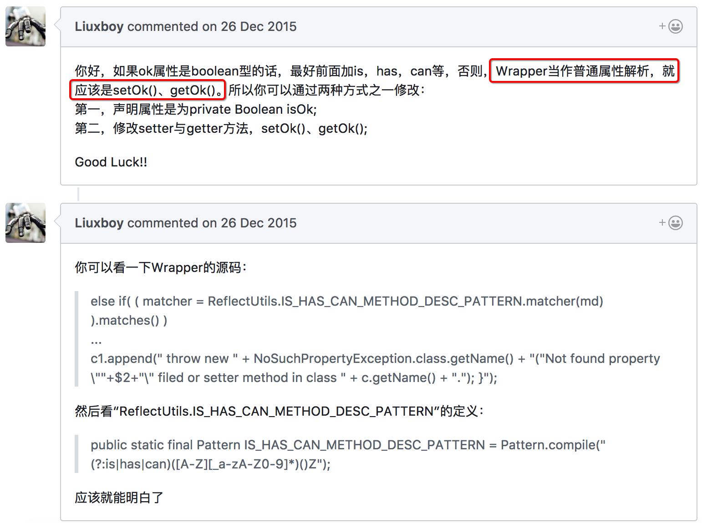

Wrapper类在处理JSON转换时无法处理Boolean类型字段isXxx方法，只匹配了boolean类型
======================================================
> 2017-11-23


## 1.认识问题
某同学反馈：我升级了你们链路跟踪，**现在线上应用日志里出现这种错误，不知道对应用会不会有影响？**

`dubbo`版本：`2.5.3`

**这个是Boolean属性，于是is，set方法。**
原来没升级之前是OK的，这个能帮忙看一下吗？日志里好多这个报错。


## 2.分析问题
根据异常日志，异常是从`AccessLogFilter`抛出来的，原因可能是由于`未定义emailForward字段的getter方法`。

com.alibaba.dubbo.rpc.filter.AccessLogFilter：
```java
    public Result invoke(Invoker<?> invoker, Invocation inv) throws RpcException {
        try {
            String accesslog = invoker.getUrl().getParameter(Constants.ACCESS_LOG_KEY);
            if (ConfigUtils.isNotEmpty(accesslog)) {
                ......
                Object[] args = inv.getArguments();
                if (args != null && args.length > 0) {
                    sn.append(JSON.json(args)); // 抛异常的地方
                }
                ......
            }
        } catch (Throwable t) { // 捕获任何异常，不影响调用逻辑
            logger.warn("Exception in AcessLogFilter of service(" + invoker + " -> " + inv + ")", t);
        }
        // 在调用服务方法之前记录访问日志
        return invoker.invoke(inv);
    }
```
从源码看，AccessLogFilter 抛出的异常，不影响服务方法执行。

> 赤焰：现在线上应用日志里出现这种错误，不知道对应用会不会有影响？

> 解答：**打印请求访问日志已捕获任何异常，所以不会影响正常的调用逻辑。**

通过单元测试(UT)验证，dubbo内部的JSON实现确实存在这个问题，而FastJSON能解决这个问题。
同时，在dubbo社区找到了别人提的Issue-[Wrapper类在处理Json转换的时候无法处理Boolean类型字段isXX方法，只匹配了boolean类型](https://github.com/alibaba/dubbo/pull/136)，问题原因见下图。




## 3.解决问题
* 临时解决：由于业务方应用已经接入链路跟踪，避免影响查看日志，建议先关闭打印访问日志功能。
* 最终解决：参考`dubbo-2.5.7`的做法，**将JSON改为FastJSON**。因为JSON只是FastJSON先前版本的精简版，很难和FastJSON保持同步。(见 [Deprecate internal JSON impl and change to fastjson #776](https://github.com/alibaba/dubbo/pull/776))

