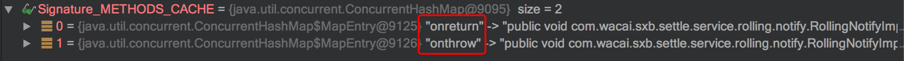
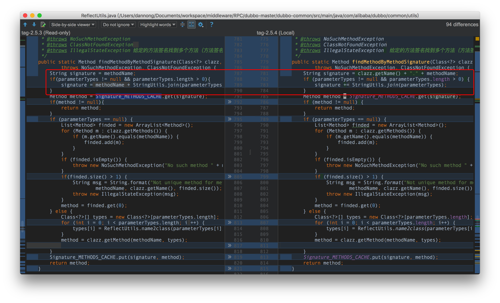
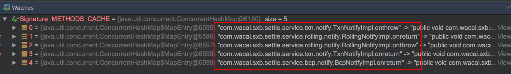

dubbo-2.5.3异步回调出现回调错乱问题
=======================
> 2017-12-18


## 1.认识问题
某同学反馈：
* xxx-boot版本升级到1.1.2后，dubbo版本被动从3.0.4升级到3.1.1；
  dubbo异步回调出现了不回调或者回调错乱。有人遇见过吗？
* 我们`sxb-settle-service`项目中用到了dubbo异步回调功能，在xxx-boot-1.0.6版本未升级前没问题；一致正常执行。
  升级到1.1.2后，发现异步回调出问题了：异步回调不生效；和回调错乱，就是没有回调配置的方法。

Dubbo异步回调配置：

### 异常日志
问题：本来应该调用`BcpNotifyImpl.onthrow()`方法，实际却调用到`RollingNotifyImpl.onthrow()`。
```
2017-12-17 21:17:46,425 ERROR [DubboClientHandler-172.16.133.154:20888-thread-2] c.a.d.r.p.d.filter.FutureFilter -  [DUBBO] compare.call back method invoke error . callback method :
public void com.xxx.sxb.settle.service.rolling.notify.RollingNotifyImpl.onthrow(java.lang.Throwable,java.lang.String,java.lang.String,com.xxx.sxb.position.core.dto.PositionTradeForRollingSumDto,java.lang.String,com.xxx.fund.parent.client.enums.CashFlowBatchEnum), url:dubbo://172.16.133.154:20888/com.xxx.sxb.settle.service.bcp.CompareService?accesslog=true&anyhost=true&application=sxb-settle-service&check=false&compare.async=true&default.check=false&default.loadbalance=random&default.timeout=300000&dubbo=3.1.1&interface=com.xxx.sxb.settle.service.bcp.CompareService&methods=compare&owner=tilu&pid=7280&retries=0&side=consumer&timeout=300000&timestamp=1513515833384, dubbo version: 3.1.1, current host: 172.16.133.154
java.lang.IllegalArgumentException: object is not an instance of declaring class
	at sun.reflect.NativeMethodAccessorImpl.invoke0(Native Method)
	at sun.reflect.NativeMethodAccessorImpl.invoke(NativeMethodAccessorImpl.java:62)
	at sun.reflect.DelegatingMethodAccessorImpl.invoke(DelegatingMethodAccessorImpl.java:43)
	at java.lang.reflect.Method.invoke(Method.java:498)
	at com.alibaba.dubbo.rpc.protocol.dubbo.filter.FutureFilter.fireThrowCallback(FutureFilter.java:197)
	at com.alibaba.dubbo.rpc.protocol.dubbo.filter.FutureFilter.fireReturnCallback(FutureFilter.java:160)
	at com.alibaba.dubbo.rpc.protocol.dubbo.filter.FutureFilter.access$100(FutureFilter.java:44)
	at com.alibaba.dubbo.rpc.protocol.dubbo.filter.FutureFilter$1.done(FutureFilter.java:89)
	at com.alibaba.dubbo.remoting.exchange.support.DefaultFuture.invokeCallback(DefaultFuture.java:158)
	at com.alibaba.dubbo.remoting.exchange.support.DefaultFuture.doReceived(DefaultFuture.java:264)
	at com.alibaba.dubbo.remoting.exchange.support.DefaultFuture.received(DefaultFuture.java:240)
	at com.alibaba.dubbo.remoting.exchange.support.header.HeaderExchangeHandler.handleResponse(HeaderExchangeHandler.java:96)
	at com.alibaba.dubbo.remoting.exchange.support.header.HeaderExchangeHandler.received(HeaderExchangeHandler.java:177)
	at com.alibaba.dubbo.remoting.transport.DecodeHandler.received(DecodeHandler.java:52)
	at com.alibaba.dubbo.remoting.transport.dispatcher.ChannelEventRunnable.run(ChannelEventRunnable.java:82)
	at java.util.concurrent.ThreadPoolExecutor.runWorker(ThreadPoolExecutor.java:1142)
	at java.util.concurrent.ThreadPoolExecutor$Worker.run(ThreadPoolExecutor.java:617)
	at java.lang.Thread.run(Thread.java:745)
```


## 2.分析问题
通过debug在本地重现了问题：`回调方法和所属对象不匹配`。


继续 debug 反追踪，**发现问题原因**是 **dubbo-2.5.3 的 `com.alibaba.dubbo.common.utils.ReflectUtils#SignatureMETHODSCACHE` 映射表的 key 设计存在缺陷，`key 只包含方法名称/methodName`。`若超过两个相同的回调定义，就只会使用第一次设置的那个`**。

com.alibaba.dubbo.common.utils.ReflectUtils
```java
	private static final ConcurrentMap<String, Method>  Signature_METHODS_CACHE = new ConcurrentHashMap<String, Method>();

	/**
	 * 根据方法签名从类中找出方法。
	 */
	public static Method findMethodByMethodSignature(Class<?> clazz, String methodName, String[] parameterTypes)
	        throws NoSuchMethodException, ClassNotFoundException {
	    // 设计问题：key 只包含方法名称
            String signature = methodName;
            if(parameterTypes != null && parameterTypes.length > 0){
                signature = methodName + StringUtils.join(parameterTypes);
            }
            Method method = Signature_METHODS_CACHE.get(signature);
            if(method != null){
                return method;
            }
            ......
            Signature_METHODS_CACHE.put(signature, method);
            return method;
        }
```

hokage-3.1.1（fork 自社区 dubbo-2.5.3）：


**社区的修复方法**是 **`key 增加类完全限定名前缀，即"className + methodName"`**。


hokage-3.0.4（fork 自社区 dubbo-2.5.4-SNAPSHOT），正常


com.alibaba.dubbo.common.utils.ReflectUtils
```java
    /**
     * 根据方法签名从类中找出方法。
     */
    public static Method findMethodByMethodSignature(Class<?> clazz, String methodName, String[] parameterTypes)
            throws NoSuchMethodException, ClassNotFoundException {
        // className + methodName
        String signature = clazz.getName() + "." + methodName;
        if (parameterTypes != null && parameterTypes.length > 0) {
            signature += StringUtils.join(parameterTypes);
        }
        Method method = Signature_METHODS_CACHE.get(signature);
        if (method != null) {
            return method;
        }
        ......
        Signature_METHODS_CACHE.put(signature, method);
        return method;
    }
```


## 3.解决问题
* 由于社区dubbo从2.5.4到2.5.8版本之间修复了不少问题，所以计划基于官方2.5.8正式版重新fork一个新版本出来，同时也修复了该问题。

