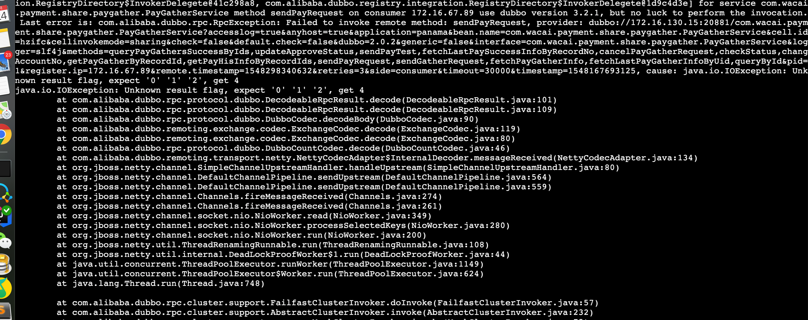

消费者报"Unknown result flag, expect '0' '1' '2', get *"异常
======================================================
> 2019-01-28


## 1.认识问题
某同学在`2019-01-24 14:29`反馈，K2环境其应用报`IOException: Unknown result flag, expect '0' '1' '2', get 4`异常。



完整的异常调用栈：
```java
2019-01-24 10:53:46,101 ERROR [hermes-conusmer-thread-loan.payment.waitpay-third-payment-0] [04e04b772a54b6bb] c.w.l.p.s.pay.PaymentBaseService - [PayRequest] pay request error, aid=927582212
#提供者使用的Dubbo版本：dubbo=2.0.2（对应社区dubbo-2.6.5）
com.alibaba.dubbo.rpc.RpcException: Failfast invoke providers dubbo://172.16.130.15:20881/com.xxx.payment.share.paygather.PayGatherService?accesslog=true&anyhost=true&application=panama&bean.name=com.xxx.payment.share.paygather.PayGatherService&cell.id=hzifc&cellinvokemode=sharing&check=false&default.check=false&dubbo=2.0.2&generic=false&interface=com.xxx.payment.share.paygather.PayGatherService&logger=slf4j&methods=queryPayGathersSuccessByIds,updateApproveStatus,sendPayTest,fetchLastPaySuccessInfoByRecordNo,cancelPayGatherRequest,checkStatus,changAccountNo,getPayGatherByRecordId,getPayHisInfoByRecordIds,sendPayRequest,sendGatherRequest,fetchPayGatherInfo,fetchLastPayGatherInfoByUid,queryById&pid=1&register.ip=172.16.67.89&remote.timestamp=1548298340632&retries=3&side=consumer&timeout=30000&timestamp=1548167693125
#消费者使用的Dubbo版本：3.2.1（对应社区dubbo-2.5.8）
RandomLoadBalance select from all providers [com.alibaba.dubbo.registry.integration.RegistryDirectory$InvokerDelegete@41c298a8, com.alibaba.dubbo.registry.integration.RegistryDirectory$InvokerDelegete@1d9c4d3e] for service com.xxx.payment.share.paygather.PayGatherService method sendPayRequest on consumer 172.16.67.89 use dubbo version 3.2.1, but no luck to perform the invocation. Last error is: com.alibaba.dubbo.rpc.RpcException: Failed to invoke remote method: sendPayRequest, provider: dubbo://172.16.130.15:20881/com.xxx.payment.share.paygather.PayGatherService?accesslog=true&anyhost=true&application=panama&bean.name=com.xxx.payment.share.paygather.PayGatherService&cell.id=hzifc&cellinvokemode=sharing&check=false&default.check=false&dubbo=2.0.2&generic=false&interface=com.xxx.payment.share.paygather.PayGatherService&logger=slf4j&methods=queryPayGathersSuccessByIds,updateApproveStatus,sendPayTest,fetchLastPaySuccessInfoByRecordNo,cancelPayGatherRequest,checkStatus,changAccountNo,getPayGatherByRecordId,getPayHisInfoByRecordIds,sendPayRequest,sendGatherRequest,fetchPayGatherInfo,fetchLastPayGatherInfoByUid,queryById&pid=1&register.ip=172.16.67.89&remote.timestamp=1548298340632&retries=3&side=consumer&timeout=30000&timestamp=1548167693125, cause: java.io.IOException: Unknown result flag, expect '0' '1' '2', get 4
java.io.IOException: Unknown result flag, expect '0' '1' '2', get 4
        at com.alibaba.dubbo.rpc.protocol.dubbo.DecodeableRpcResult.decode(DecodeableRpcResult.java:101)
        at com.alibaba.dubbo.rpc.protocol.dubbo.DecodeableRpcResult.decode(DecodeableRpcResult.java:109)
        at com.alibaba.dubbo.rpc.protocol.dubbo.DubboCodec.decodeBody(DubboCodec.java:90)
        at com.alibaba.dubbo.remoting.exchange.codec.ExchangeCodec.decode(ExchangeCodec.java:119)
        at com.alibaba.dubbo.remoting.exchange.codec.ExchangeCodec.decode(ExchangeCodec.java:80)
        at com.alibaba.dubbo.rpc.protocol.dubbo.DubboCountCodec.decode(DubboCountCodec.java:46)
        at com.alibaba.dubbo.remoting.transport.netty.NettyCodecAdapter$InternalDecoder.messageReceived(NettyCodecAdapter.java:134)
        at org.jboss.netty.channel.SimpleChannelUpstreamHandler.handleUpstream(SimpleChannelUpstreamHandler.java:80)
        at org.jboss.netty.channel.DefaultChannelPipeline.sendUpstream(DefaultChannelPipeline.java:564)
        at org.jboss.netty.channel.DefaultChannelPipeline.sendUpstream(DefaultChannelPipeline.java:559)
        at org.jboss.netty.channel.Channels.fireMessageReceived(Channels.java:274)
        at org.jboss.netty.channel.Channels.fireMessageReceived(Channels.java:261)
        at org.jboss.netty.channel.socket.nio.NioWorker.read(NioWorker.java:349)
        at org.jboss.netty.channel.socket.nio.NioWorker.processSelectedKeys(NioWorker.java:280)
        at org.jboss.netty.channel.socket.nio.NioWorker.run(NioWorker.java:200)
        at org.jboss.netty.util.ThreadRenamingRunnable.run(ThreadRenamingRunnable.java:108)
        at org.jboss.netty.util.internal.DeadLockProofWorker$1.run(DeadLockProofWorker.java:44)
        at java.util.concurrent.ThreadPoolExecutor.runWorker(ThreadPoolExecutor.java:1149)
        at java.util.concurrent.ThreadPoolExecutor$Worker.run(ThreadPoolExecutor.java:624)
        at java.lang.Thread.run(Thread.java:748)

        at com.alibaba.dubbo.rpc.cluster.support.FailfastClusterInvoker.doInvoke(FailfastClusterInvoker.java:57)
        at com.alibaba.dubbo.rpc.cluster.support.AbstractClusterInvoker.invoke(AbstractClusterInvoker.java:232)
        at com.alibaba.dubbo.rpc.cluster.support.wrapper.MockClusterInvoker.invoke(MockClusterInvoker.java:72)
        at com.alibaba.dubbo.rpc.proxy.InvokerInvocationHandler.invoke(InvokerInvocationHandler.java:52)
        at com.alibaba.dubbo.common.bytecode.proxy0.sendPayRequest(proxy0.java)
        at com.xxx.loan.panama.service.pay.PaymentBaseService.lambda$getCommand$0(PaymentBaseService.java:157)
        at com.xxx.loan.panama.service.pay.PaymentBaseService.generatePayRequest(PaymentBaseService.java:105)
        at com.xxx.loan.panama.consumer.WaitPayConsumer.process(WaitPayConsumer.java:163)
        at com.xxx.loan.panama.consumer.WaitPayConsumer.onMessageReceived(WaitPayConsumer.java:108)
        at com.xxx.hermes.agent.util.HermesUtil.onMessageReceived(HermesUtil.java:248)
        at com.xxx.hermes.agent.util.HermesUtil.onMessageReceivedWrapper(HermesUtil.java:203)
        at com.xxx.hermes.agent.consumer.processor.AbstractConsumerProcessor.processBatchMessage(AbstractConsumerProcessor.java:113)
        at com.xxx.hermes.agent.consumer.processor.FailFastConsumerProcessor.process(FailFastConsumerProcessor.java:37)
        at com.xxx.hermes.agent.consumer.simple.ConsumerWorkerThread.run(ConsumerWorkerThread.java:67)
        at java.util.concurrent.Executors$RunnableAdapter.call(Executors.java:511)
        at java.util.concurrent.FutureTask.run(FutureTask.java:266)
        at java.util.concurrent.ThreadPoolExecutor.runWorker(ThreadPoolExecutor.java:1149)
        at java.util.concurrent.ThreadPoolExecutor$Worker.run(ThreadPoolExecutor.java:624)
        at java.lang.Thread.run(Thread.java:748)

Caused by: com.alibaba.dubbo.remoting.RemotingException: java.io.IOException: Unknown result flag, expect '0' '1' '2', get 4
java.io.IOException: Unknown result flag, expect '0' '1' '2', get 4
        at com.alibaba.dubbo.rpc.protocol.dubbo.DecodeableRpcResult.decode(DecodeableRpcResult.java:101)
        at com.alibaba.dubbo.rpc.protocol.dubbo.DecodeableRpcResult.decode(DecodeableRpcResult.java:109)
        at com.alibaba.dubbo.rpc.protocol.dubbo.DubboCodec.decodeBody(DubboCodec.java:90)
        at com.alibaba.dubbo.remoting.exchange.codec.ExchangeCodec.decode(ExchangeCodec.java:119)
        at com.alibaba.dubbo.remoting.exchange.codec.ExchangeCodec.decode(ExchangeCodec.java:80)
        at com.alibaba.dubbo.rpc.protocol.dubbo.DubboCountCodec.decode(DubboCountCodec.java:46)
        at com.alibaba.dubbo.remoting.transport.netty.NettyCodecAdapter$InternalDecoder.messageReceived(NettyCodecAdapter.java:134)
        at org.jboss.netty.channel.SimpleChannelUpstreamHandler.handleUpstream(SimpleChannelUpstreamHandler.java:80)
        at org.jboss.netty.channel.DefaultChannelPipeline.sendUpstream(DefaultChannelPipeline.java:564)
        at org.jboss.netty.channel.DefaultChannelPipeline.sendUpstream(DefaultChannelPipeline.java:559)
        at org.jboss.netty.channel.Channels.fireMessageReceived(Channels.java:274)
        at org.jboss.netty.channel.Channels.fireMessageReceived(Channels.java:261)
        at org.jboss.netty.channel.socket.nio.NioWorker.read(NioWorker.java:349)
        at org.jboss.netty.channel.socket.nio.NioWorker.processSelectedKeys(NioWorker.java:280)
        at org.jboss.netty.channel.socket.nio.NioWorker.run(NioWorker.java:200)
        at org.jboss.netty.util.ThreadRenamingRunnable.run(ThreadRenamingRunnable.java:108)
        at org.jboss.netty.util.internal.DeadLockProofWorker$1.run(DeadLockProofWorker.java:44)
        at java.util.concurrent.ThreadPoolExecutor.runWorker(ThreadPoolExecutor.java:1149)
        at java.util.concurrent.ThreadPoolExecutor$Worker.run(ThreadPoolExecutor.java:624)
        at java.lang.Thread.run(Thread.java:748)

        at com.alibaba.dubbo.remoting.exchange.support.DefaultFuture.returnFromResponse(DefaultFuture.java:220)
        at com.alibaba.dubbo.remoting.exchange.support.DefaultFuture.get(DefaultFuture.java:139)
        at com.alibaba.dubbo.remoting.exchange.support.DefaultFuture.get(DefaultFuture.java:113)
        at com.alibaba.dubbo.rpc.protocol.dubbo.DubboInvoker.doInvoke$impl(DubboInvoker.java:100)
        ... 29 common frames omitted
2019-01-24 10:53:46,099 WARN  [New I/O client worker #1-12] [] c.a.d.r.e.codec.ExchangeCodec -  [DUBBO] Skip input stream 344, dubbo version: 3.2.1, current host: 172.16.67.89


#提供者使用的Dubbo版本：dubbo=2.0.2（对应社区dubbo-2.6.5）
com.alibaba.dubbo.rpc.RpcException: Failfast invoke providers dubbo://172.16.130.15:20881/com.xxx.payment.share.paygather.PayGatherService?accesslog=true&anyhost=true&application=panama&bean.name=com.xxx.payment.share.paygather.PayGatherService&cell.id=hzifc&cellinvokemode=sharing&check=false&default.check=false&dubbo=2.0.2&generic=false&interface=com.xxx.payment.share.paygather.PayGatherService&logger=slf4j&methods=queryPayGathersSuccessByIds,updateApproveStatus,sendPayTest,fetchLastPaySuccessInfoByRecordNo,cancelPayGatherRequest,checkStatus,changAccountNo,getPayGatherByRecordId,getPayHisInfoByRecordIds,sendPayRequest,sendGatherRequest,fetchPayGatherInfo,fetchLastPayGatherInfoByUid,queryById&pid=1&register.ip=172.16.70.223&remote.timestamp=1548318224190&retries=3&side=consumer&timeout=30000&timestamp=1548314072355
#消费者使用的Dubbo版本：3.2.1（对应社区dubbo-2.5.8）
RandomLoadBalance select from all providers [com.alibaba.dubbo.registry.integration.RegistryDirectory$InvokerDelegete@5b8b51aa, com.alibaba.dubbo.registry.integration.RegistryDirectory$InvokerDelegete@5b1ee0fc] for service com.xxx.payment.share.paygather.PayGatherService method fetchPayGatherInfo on consumer 172.16.70.223 use dubbo version 3.2.1, but no luck to perform the invocation.
Last error is: com.alibaba.dubbo.rpc.RpcException: Failed to invoke remote method: fetchPayGatherInfo, provider: dubbo://172.16.130.15:20881/com.xxx.payment.share.paygather.PayGatherService?accesslog=true&anyhost=true&application=panama&bean.name=com.xxx.payment.share.paygather.PayGatherService&cell.id=hzifc&cellinvokemode=sharing&check=false&default.check=false&dubbo=2.0.2&generic=false&interface=com.xxx.payment.share.paygather.PayGatherService&logger=slf4j&methods=queryPayGathersSuccessByIds,updateApproveStatus,sendPayTest,fetchLastPaySuccessInfoByRecordNo,cancelPayGatherRequest,checkStatus,changAccountNo,getPayGatherByRecordId,getPayHisInfoByRecordIds,sendPayRequest,sendGatherRequest,fetchPayGatherInfo,fetchLastPayGatherInfoByUid,queryById&pid=1&register.ip=172.16.70.223&remote.timestamp=1548318224190&retries=3&side=consumer&timeout=30000&timestamp=1548314072355, cause: java.io.IOException: Unknown result flag, expect '0' '1' '2', get 5
java.io.IOException: Unknown result flag, expect '0' '1' '2', get 5
	at com.alibaba.dubbo.rpc.protocol.dubbo.DecodeableRpcResult.decode(DecodeableRpcResult.java:101)
	at com.alibaba.dubbo.rpc.protocol.dubbo.DecodeableRpcResult.decode(DecodeableRpcResult.java:109)
	at com.alibaba.dubbo.rpc.protocol.dubbo.DubboCodec.decodeBody(DubboCodec.java:90)
	at com.alibaba.dubbo.remoting.exchange.codec.ExchangeCodec.decode(ExchangeCodec.java:119)
	at com.alibaba.dubbo.remoting.exchange.codec.ExchangeCodec.decode(ExchangeCodec.java:80)
	at com.alibaba.dubbo.rpc.protocol.dubbo.DubboCountCodec.decode(DubboCountCodec.java:46)
	at com.alibaba.dubbo.remoting.transport.netty.NettyCodecAdapter$InternalDecoder.messageReceived(NettyCodecAdapter.java:134)
	at org.jboss.netty.channel.SimpleChannelUpstreamHandler.handleUpstream(SimpleChannelUpstreamHandler.java:80)
	at org.jboss.netty.channel.DefaultChannelPipeline.sendUpstream(DefaultChannelPipeline.java:564)
	at org.jboss.netty.channel.DefaultChannelPipeline.sendUpstream(DefaultChannelPipeline.java:559)
	at org.jboss.netty.channel.Channels.fireMessageReceived(Channels.java:274)
	at org.jboss.netty.channel.Channels.fireMessageReceived(Channels.java:261)
	at org.jboss.netty.channel.socket.nio.NioWorker.read(NioWorker.java:349)
	at org.jboss.netty.channel.socket.nio.NioWorker.processSelectedKeys(NioWorker.java:280)
	at org.jboss.netty.channel.socket.nio.NioWorker.run(NioWorker.java:200)
	at org.jboss.netty.util.ThreadRenamingRunnable.run(ThreadRenamingRunnable.java:108)
	at org.jboss.netty.util.internal.DeadLockProofWorker$1.run(DeadLockProofWorker.java:44)
	at java.util.concurrent.ThreadPoolExecutor.runWorker(ThreadPoolExecutor.java:1149)
	at java.util.concurrent.ThreadPoolExecutor$Worker.run(ThreadPoolExecutor.java:624)
	at java.lang.Thread.run(Thread.java:748)

	at com.alibaba.dubbo.rpc.cluster.support.FailfastClusterInvoker.doInvoke(FailfastClusterInvoker.java:57)
	at com.alibaba.dubbo.rpc.cluster.support.AbstractClusterInvoker.invoke(AbstractClusterInvoker.java:232)
	at com.alibaba.dubbo.rpc.cluster.support.wrapper.MockClusterInvoker.invoke(MockClusterInvoker.java:72)
	at com.alibaba.dubbo.rpc.proxy.InvokerInvocationHandler.invoke(InvokerInvocationHandler.java:52)
	at com.alibaba.dubbo.common.bytecode.proxy0.fetchPayGatherInfo(proxy0.java)
	at com.xxx.loan.panama.service.core.PayGatherServiceProxy.fetch(PayGatherServiceProxy.java:195)
	at com.xxx.loan.panama.service.gather.GeneralGatherProcessor.buildFailMsg(GeneralGatherProcessor.java:141)
	at com.xxx.loan.panama.service.gather.GeneralGatherProcessor.sendRepayDetail(GeneralGatherProcessor.java:128)
	at com.xxx.loan.panama.service.gather.GeneralGatherProcessor.process(GeneralGatherProcessor.java:94)
	at com.xxx.loan.panama.service.core.PaymentResultService.process(PaymentResultService.java:33)
	at com.xxx.loan.panama.consumer.PayGatherConsumer.onMessageReceived(PayGatherConsumer.java:76)
	at com.xxx.common.kafka.consumer.AbstractHttpConsumer.process(AbstractHttpConsumer.java:99)
	at com.xxx.common.kafka.consumer.Looper$3.perform(Looper.java:207)
	at com.xxx.common.kafka.consumer.Looper.performAction(Looper.java:106)
	at com.xxx.common.kafka.consumer.Looper.loop(Looper.java:78)
	at com.xxx.common.kafka.consumer.Looper.run(Looper.java:43)

Caused by: com.alibaba.dubbo.remoting.RemotingException: java.io.IOException: Unknown result flag, expect '0' '1' '2', get 5
java.io.IOException: Unknown result flag, expect '0' '1' '2', get 5
	at com.alibaba.dubbo.rpc.protocol.dubbo.DecodeableRpcResult.decode(DecodeableRpcResult.java:101)
	at com.alibaba.dubbo.rpc.protocol.dubbo.DecodeableRpcResult.decode(DecodeableRpcResult.java:109)
	at com.alibaba.dubbo.rpc.protocol.dubbo.DubboCodec.decodeBody(DubboCodec.java:90)
	at com.alibaba.dubbo.remoting.exchange.codec.ExchangeCodec.decode(ExchangeCodec.java:119)
	at com.alibaba.dubbo.remoting.exchange.codec.ExchangeCodec.decode(ExchangeCodec.java:80)
	at com.alibaba.dubbo.rpc.protocol.dubbo.DubboCountCodec.decode(DubboCountCodec.java:46)
	at com.alibaba.dubbo.remoting.transport.netty.NettyCodecAdapter$InternalDecoder.messageReceived(NettyCodecAdapter.java:134)
	at org.jboss.netty.channel.SimpleChannelUpstreamHandler.handleUpstream(SimpleChannelUpstreamHandler.java:80)
	at org.jboss.netty.channel.DefaultChannelPipeline.sendUpstream(DefaultChannelPipeline.java:564)
	at org.jboss.netty.channel.DefaultChannelPipeline.sendUpstream(DefaultChannelPipeline.java:559)
	at org.jboss.netty.channel.Channels.fireMessageReceived(Channels.java:274)
	at org.jboss.netty.channel.Channels.fireMessageReceived(Channels.java:261)
	at org.jboss.netty.channel.socket.nio.NioWorker.read(NioWorker.java:349)
	at org.jboss.netty.channel.socket.nio.NioWorker.processSelectedKeys(NioWorker.java:280)
	at org.jboss.netty.channel.socket.nio.NioWorker.run(NioWorker.java:200)
	at org.jboss.netty.util.ThreadRenamingRunnable.run(ThreadRenamingRunnable.java:108)
	at org.jboss.netty.util.internal.DeadLockProofWorker$1.run(DeadLockProofWorker.java:44)
	at java.util.concurrent.ThreadPoolExecutor.runWorker(ThreadPoolExecutor.java:1149)
	at java.util.concurrent.ThreadPoolExecutor$Worker.run(ThreadPoolExecutor.java:624)
	at java.lang.Thread.run(Thread.java:748)

	at com.alibaba.dubbo.remoting.exchange.support.DefaultFuture.returnFromResponse(DefaultFuture.java:220)
	at com.alibaba.dubbo.remoting.exchange.support.DefaultFuture.get(DefaultFuture.java:139)
	at com.alibaba.dubbo.remoting.exchange.support.DefaultFuture.get(DefaultFuture.java:113)
	at com.alibaba.dubbo.rpc.protocol.dubbo.DubboInvoker.doInvoke$impl(DubboInvoker.java:100)
	... 26 common frames omitted
```


## 2.分析问题
见[DubboCodec](https://github.com/apache/incubator-dubbo/blob/dubbo-2.5.8/dubbo-rpc/dubbo-rpc-default/src/main/java/com/alibaba/dubbo/rpc/protocol/dubbo/DubboCodec.java)类中的`RESPONSE_*`常量列表：
```java
public class DubboCodec extends ExchangeCodec implements Codec2 {

    public static final String NAME = "dubbo";
    public static final String DUBBO_VERSION = Version.getVersion(DubboCodec.class, Version.getVersion());
    public static final byte RESPONSE_WITH_EXCEPTION = 0;
    public static final byte RESPONSE_VALUE = 1;
    public static final byte RESPONSE_NULL_VALUE = 2;
...
}
```

从`dubbo-2.6.3`版本开始，`dubbo`协议的`DubboCodec`新增`RESPONSE_WITH_EXCEPTION_WITH_ATTACHMENTS, RESPONSE_VALUE_WITH_ATTACHMENTS, RESPONSE_NULL_VALUE_WITH_ATTACHMENTS`：
```java
public class DubboCodec extends ExchangeCodec implements Codec2 {

    public static final String NAME = "dubbo";
    public static final String DUBBO_VERSION = Version.getProtocolVersion();
    public static final byte RESPONSE_WITH_EXCEPTION = 0;
    public static final byte RESPONSE_VALUE = 1;
    public static final byte RESPONSE_NULL_VALUE = 2;
    public static final byte RESPONSE_WITH_EXCEPTION_WITH_ATTACHMENTS = 3;
    public static final byte RESPONSE_VALUE_WITH_ATTACHMENTS = 4;
    public static final byte RESPONSE_NULL_VALUE_WITH_ATTACHMENTS = 5;
...
}
```

受影响版本：`dubbo-2.6.3`+, `dubbo-2.7.0`+

社区反馈的Issues：
* [dubbo 2.6.3 is not compatible with dubbo >= 2.5.9 \#2174](https://github.com/apache/incubator-dubbo/issues/2174)
* [using the dubbo-2.5.10 boot log output version is 2.0.1, why? \#2313](https://github.com/apache/incubator-dubbo/issues/2313)
* [[DUBBO-3537]: dubbox升级dubbo版本的兼容性问题 \#3996](https://github.com/apache/dubbo/pull/3996)


## 3.解决问题
**升级方案：消费者应用先升级(兼容新版`dubbo`协议)，提供者应用必须后升级**。

**解决方案：接入`nest-parent`，使用最新的`dubbo-3.3.5`+**。

