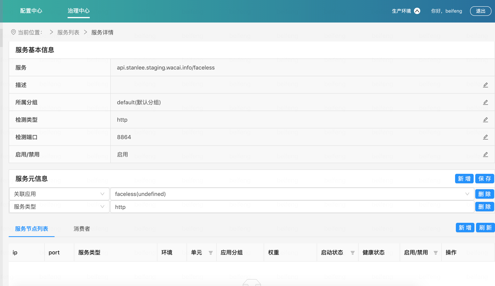
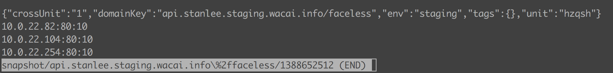
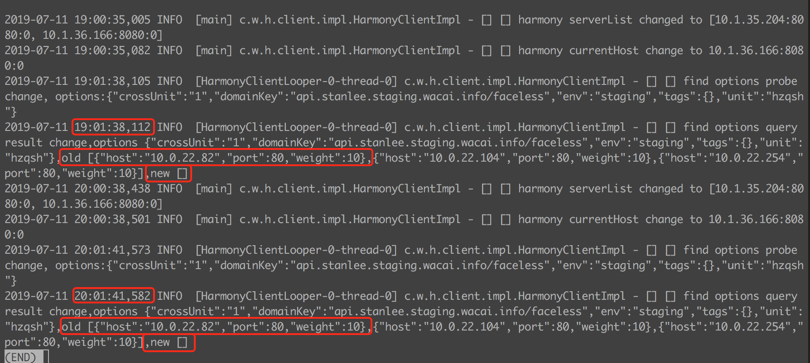

某服务域名节点在harmony服务器为空后，客户端本地缓存文件却没有更新
====================================
> 2019-07-26


## 1.认识问题
风控同学反馈，harmony貌似有个bug，虚拟机 xxx `/home/appweb/.harmony/snapshot/xxx%2ffaceless`这个文件没有更新。
北风反馈，我们应用里访问meta服务地址 [http://xxx/faceless/meta/apply_cnt_latest_clear2now]() 域名兜底失败了。



真实情况是，`xxx/faceless`在harmony服务器已没有服务节点，但harmony客户端缓存的域名镜像文件却还有节点。


## 2.分析问题
域名镜像文件最后更新时间为`2019-07-10 17:39`，客户端日志看到在`2019-07-11 19:01:38,112`和`2019-07-11 20:01:41,582`都发现`xxx/faceless`域名的服务节点为空，但这两次都没有更新域名镜像文件。结合 harmony-client.log 和域名镜像文件的数据和时间点，客户端本地文件节点数据是与服务器不一致，再结合源代码确认是 harmony-client 的问题。

对于“域名兜底失败，临时怎么处理可以成功”问题，删除这台服务器上的域名镜像本地缓存文件解决这个问题。



```
$ ll -h snapshot/xxx%2ffaceless/
-rw-rw-r-- 1 appweb appweb 170 Jul 10 17:39 1388652512
```




## 3.解决问题
当域名本地缓存文件存在时，需要更新节点列表，不管节点列表是否为空。

