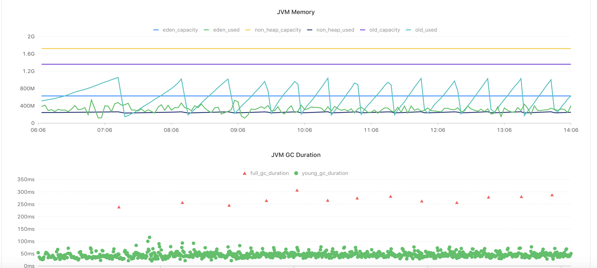

某应用一天触发27次FGC
==============
> 2019-09-06


## 1.认识问题
某同学反馈，从某应用监控日报邮件发现一天触发`27次FGC`。




## 2.分析问题
从现象和监控看，平均每隔一个小时触发一次FGC，堆空间存在规律地线性增长。
基于这个线索，结合`jstat -gcutil`和GC日志反查问题。

1.先通过`jstat -gcutil`查看GC实时统计数据，看能否发现一些线索。
```
$ jps -mlv
6389 ./lib/magnum-provider-0.14.0.jar 
-verbose:gc -Xloggc:/data/program/com.xxx.loan/magnum-provider/0.14.0/gc_log/gc.log 
-XX:+PrintGCDetails -XX:+PrintGCDateStamps -XX:+UseGCLogFileRotation -XX:NumberOfGCLogFiles=20 -XX:GCLogFileSize=50m 
-XX:+HeapDumpOnOutOfMemoryError -XX:HeapDumpPath=/data/program/com.xxx.loan/magnum-provider/0.14.0/java.hprof 
-XX:ErrorFile=/data/program/com.xxx.loan/magnum-provider/0.14.0/java_error.log 
-Djava.awt.headless=true -Djava.security.egd=file:/dev/./urandom 
-DLOG_HOME=/data/program/logs/com.xxx.loan/magnum-provider/app_log 
-Dapp.log.dir=/data/program/logs/com.xxx.loan/magnum-provider/app_log 
-Dserver.tomcat.access-log-enabled=true -Dserver.tomcat.basedir=/data/program/com.xxx.loan/magnum-provider 
-Dmanagement.port=-1 -Dendpoints.shutdown.enabled=true -Dshell.telnet.enabled=false 
-Dcom.sun.management.jmxremote.authenticate=false -Dcom.sun.management.jmxremote.ssl=false 
-Xms2g -Xmx2g -XX:MetaspaceSize=38m -XX:MaxMetaspaceSize=380m -XX:NewSize=600m -XX:MaxNewSize=750m 
-XX:+UseCompressedOops -XX:+UseConcMarkSweepGC -XX:+UseParNewGC

$ jstat -gcutil -h7 6389 1s
  S0     S1     E      O      M     CCS    YGC     YGCT    FGC    FGCT     GCT
  0.00  70.69  10.37  68.94  76.77  49.92   3697  165.734    52    6.994  172.728
  0.00  70.69  15.96  68.94  76.77  49.92   3697  165.734    52    6.994  172.728
  0.00  70.69  19.82  68.94  76.77  49.92   3697  165.734    52    6.994  172.728
  0.00  70.69  27.14  68.94  76.77  49.92   3697  165.734    52    6.994  172.728
  0.00  70.69  34.18  68.94  76.77  49.92   3697  165.734    52    6.994  172.728
  0.00  70.69  37.85  68.94  76.77  49.92   3697  165.734    52    6.994  172.728
  0.00  70.69  44.02  68.94  76.77  49.92   3697  165.734    52    6.994  172.728
  S0     S1     E      O      M     CCS    YGC     YGCT    FGC    FGCT     GCT
  0.00  70.69  49.00  68.94  76.77  49.92   3697  165.734    52    6.994  172.728
  0.00  70.69  54.82  68.94  76.77  49.92   3697  165.734    52    6.994  172.728
  0.00  70.69  60.08  68.94  76.77  49.92   3697  165.734    52    6.994  172.728
  0.00  70.69  72.55  68.94  76.77  49.92   3697  165.734    52    6.994  172.728
  0.00  70.69  77.65  68.94  76.77  49.92   3697  165.734    52    6.994  172.728
  0.00  70.69  83.13  68.94  76.77  49.92   3697  165.734    52    6.994  172.728
  0.00  70.69  90.50  68.94  76.77  49.92   3697  165.734    52    6.994  172.728
  S0     S1     E      O      M     CCS    YGC     YGCT    FGC    FGCT     GCT
  0.00  70.69  99.45  68.94  76.77  49.92   3697  165.734    52    6.994  172.728
 79.33   0.00  10.23  69.57  76.88  50.04   3698  165.787    52    6.994  172.780
 79.33   0.00  14.97  69.57  76.88  50.04   3698  165.787    52    6.994  172.780
 79.33   0.00  21.58  69.57  76.88  50.04   3698  165.787    52    6.994  172.780
 79.33   0.00  29.66  69.57  76.88  50.04   3698  165.787    52    6.994  172.780
 79.33   0.00  37.81  69.57  76.88  50.04   3698  165.787    52    6.994  172.780
 79.33   0.00  45.38  69.57  76.88  50.04   3698  165.787    52    6.994  172.780
```
从`jstat -gcutil`数据看，每次YGC后`Old Gen`和`Metadata`空间都有增长。
`Metadata`空间增长值得怀疑。


2.查看GC日志，看能否发现一些线索。
```
$ cd /data/program/com.xxx.loan/magnum-provider/0.14.0/gc_log/

$ grep "CMS" gc.log.0.current | less
2019-09-06T13:25:41.168+0800: 71684.899: [GC (CMS Initial Mark) [1 CMS-initial-mark: 1069522K(1329152K)] 1137441K(2020352K), 0.0322411 secs] [Times: user=0.08 sys=0.00, real=0.03 secs]
2019-09-06T13:25:41.200+0800: 71684.932: [CMS-concurrent-mark-start]
2019-09-06T13:25:41.466+0800: 71685.197: [CMS-concurrent-mark: 0.265/0.265 secs] [Times: user=0.41 sys=0.05, real=0.26 secs]
2019-09-06T13:25:41.466+0800: 71685.197: [CMS-concurrent-preclean-start]
2019-09-06T13:25:41.480+0800: 71685.211: [CMS-concurrent-preclean: 0.013/0.014 secs] [Times: user=0.02 sys=0.00, real=0.01 secs]
2019-09-06T13:25:41.480+0800: 71685.212: [CMS-concurrent-abortable-preclean-start] CMS: abort preclean due to time 2019-09-06T13:25:46.607+0800: 71690.339: [CMS-concurrent-abortable-preclean: 5.099/5.127 secs] [Times: user=6.89 sys=0.51, real=5.12 secs]
2019-09-06T13:25:46.610+0800: 71690.341: [GC (CMS Final Remark) [YG occupancy: 295319 K (691200 K)]2019-09-06T13:25:46.610+0800: 71690.341: [Rescan (parallel) , 0.0718592 secs]2019-09-06T13:25:46.682+0800: 71690.413: [weak refs processing, 0.0303513 secs]2019-09-06T13:25:46.712+0800: 71690.444: [class unloading, 0.1145074 secs]2019-09-06T13:25:46.827+0800: 71690.558: [scrub symbol table, 0.0340846 secs]2019-09-06T13:25:46.861+0800: 71690.592: [scrub string table, 0.0035977 secs][1 CMS-remark: 1069522K(1329152K)] 1364842K(2020352K), 0.2549353 secs] [Times: user=0.47 sys=0.00, real=0.26 secs]
2019-09-06T13:25:46.866+0800: 71690.598: [CMS-concurrent-sweep-start]
2019-09-06T13:25:47.311+0800: 71691.043: [CMS-concurrent-sweep: 0.426/0.445 secs] [Times: user=0.69 sys=0.09, real=0.45 secs]
2019-09-06T13:25:47.311+0800: 71691.043: [CMS-concurrent-reset-start]
2019-09-06T13:25:47.333+0800: 71691.065: [CMS-concurrent-reset: 0.022/0.022 secs] [Times: user=0.05 sys=0.00, real=0.02 secs]

2019-09-06T13:54:31.877+0800: 73415.609: [GC (CMS Initial Mark) [1 CMS-initial-mark: 1072485K(1329152K)] 1121660K(2020352K), 0.0341055 secs] [Times: user=0.09 sys=0.00, real=0.03 secs]
2019-09-06T13:54:31.912+0800: 73415.643: [CMS-concurrent-mark-start]
2019-09-06T13:54:32.148+0800: 73415.880: [CMS-concurrent-mark: 0.236/0.236 secs] [Times: user=0.36 sys=0.03, real=0.24 secs]
2019-09-06T13:54:32.148+0800: 73415.880: [CMS-concurrent-preclean-start]
2019-09-06T13:54:32.160+0800: 73415.891: [CMS-concurrent-preclean: 0.011/0.011 secs] [Times: user=0.02 sys=0.00, real=0.01 secs]
2019-09-06T13:54:32.160+0800: 73415.891: [CMS-concurrent-abortable-preclean-start] CMS: abort preclean due to time 2019-09-06T13:54:37.203+0800: 73420.934: [CMS-concurrent-abortable-preclean: 4.989/5.043 secs] [Times: user=7.49 sys=0.61, real=5.04 secs]
2019-09-06T13:54:37.206+0800: 73420.937: [GC (CMS Final Remark) [YG occupancy: 356560 K (691200 K)]2019-09-06T13:54:37.206+0800: 73420.937: [Rescan (parallel) , 0.0940238 secs]2019-09-06T13:54:37.300+0800: 73421.031: [weak refs processing, 0.0020902 secs]2019-09-06T13:54:37.302+0800: 73421.033: [class unloading, 0.1164198 secs]2019-09-06T13:54:37.418+0800: 73421.150: [scrub symbol table, 0.0336187 secs]2019-09-06T13:54:37.452+0800: 73421.184: [scrub string table, 0.0036986 secs][1 CMS-remark: 1072485K(1329152K)] 1429046K(2020352K), 0.2851077 secs] [Times: user=0.56 sys=0.00, real=0.28 secs]
2019-09-06T13:54:37.491+0800: 73421.223: [CMS-concurrent-sweep-start]
2019-09-06T13:54:38.046+0800: 73421.778: [CMS-concurrent-sweep: 0.555/0.555 secs] [Times: user=0.92 sys=0.06, real=0.56 secs]
2019-09-06T13:54:38.047+0800: 73421.778: [CMS-concurrent-reset-start]
2019-09-06T13:54:38.065+0800: 73421.796: [CMS-concurrent-reset: 0.018/0.018 secs] [Times: user=0.03 sys=0.00, real=0.02 secs]

2019-09-06T14:25:33.015+0800: 75276.746: [GC (CMS Initial Mark) [1 CMS-initial-mark: 1065743K(1329152K)] 1130129K(2020352K), 0.0319394 secs] [Times: user=0.09 sys=0.00, real=0.04 secs]
2019-09-06T14:25:33.047+0800: 75276.779: [CMS-concurrent-mark-start]
2019-09-06T14:25:33.294+0800: 75277.025: [CMS-concurrent-mark: 0.247/0.247 secs] [Times: user=0.36 sys=0.03, real=0.24 secs]
2019-09-06T14:25:33.294+0800: 75277.025: [CMS-concurrent-preclean-start]
2019-09-06T14:25:33.305+0800: 75277.036: [CMS-concurrent-preclean: 0.010/0.011 secs] [Times: user=0.01 sys=0.00, real=0.01 secs]
2019-09-06T14:25:33.305+0800: 75277.036: [CMS-concurrent-abortable-preclean-start] CMS: abort preclean due to time 2019-09-06T14:25:38.362+0800: 75282.094: [CMS-concurrent-abortable-preclean: 5.014/5.057 secs] [Times: user=6.62 sys=0.39, real=5.06 secs]
2019-09-06T14:25:38.365+0800: 75282.096: [GC (CMS Final Remark) [YG occupancy: 238122 K (691200 K)]2019-09-06T14:25:38.365+0800: 75282.096: [Rescan (parallel) , 0.0682222 secs]2019-09-06T14:25:38.433+0800: 75282.165: [weak refs processing, 0.0015964 secs]2019-09-06T14:25:38.435+0800: 75282.166: [class unloading, 0.1261325 secs]2019-09-06T14:25:38.561+0800: 75282.292: [scrub symbol table, 0.0378512 secs]2019-09-06T14:25:38.599+0800: 75282.330: [scrub string table, 0.0032971 secs][1 CMS-remark: 1065743K(1329152K)] 1303866K(2020352K), 0.2376611 secs] [Times: user=0.42 sys=0.00, real=0.24 secs]
2019-09-06T14:25:38.603+0800: 75282.335: [CMS-concurrent-sweep-start]
2019-09-06T14:25:39.159+0800: 75282.890: [CMS-concurrent-sweep: 0.542/0.555 secs] [Times: user=0.81 sys=0.03, real=0.56 secs]
2019-09-06T14:25:39.159+0800: 75282.890: [CMS-concurrent-reset-start]
2019-09-06T14:25:39.178+0800: 75282.910: [CMS-concurrent-reset: 0.019/0.019 secs] [Times: user=0.03 sys=0.01, real=0.02 secs]

# CMS两个STW阶段
2019-09-06T14:25:33.015+0800: 75276.746: [GC (CMS Initial Mark) [1 CMS-initial-mark: 1065743K(1329152K)] 1130129K(2020352K), 0.0319394 secs] [Times: user=0.09 sys=0.00, real=0.04 secs]

2019-09-06T14:25:38.365+0800: 75282.096: [GC (CMS Final Remark) [YG occupancy: 238122 K (691200 K)]2019-09-06T14:25:38.365+0800: 75282.096: 
[Rescan (parallel) , 0.0682222 secs]2019-09-06T14:25:38.433+0800: 75282.165: 
[weak refs processing, 0.0015964 secs]2019-09-06T14:25:38.435+0800: 75282.166: 
[class unloading, 0.1261325 secs]2019-09-06T14:25:38.561+0800: 75282.292: 
[scrub symbol table, 0.0378512 secs]2019-09-06T14:25:38.599+0800: 75282.330: 
[scrub string table, 0.0032971 secs]
[1 CMS-remark: 1065743K(1329152K)] 1303866K(2020352K), 0.2376611 secs] 
[Times: user=0.42 sys=0.00, real=0.24 secs]
```
`real=0.24 secs`中`class unloading, 0.1261325 secs`耗时占比`53%`，`Rescan (parallel) , 0.0682222 secs`耗时占比`28.7%`。
`class unloading`子阶段耗时占比最大，可疑性最大。

> 细心

`class unloading`表示卸载无用的类，再结合每次YGC后`Metadata`空间增长，怀疑应用会不断地创建匿名类。
如何验证？使用`Arthas`的[sc](https://alibaba.github.io/arthas/sc.html)命令
或`Greys`的[sc](https://github.com/oldmanpushcart/greys-anatomy/wiki/greys-pdf#sc%E5%91%BD%E4%BB%A4)命令，
查看JVM已加载的类信息。

```
# 所有应用的类
$ sc com.xxx.loan.magnum.*
Affect(row-cnt:1403) cost in 1610 ms.

$ sc com.xxx.loan.magnum.*
Affect(row-cnt:1403) cost in 1498 ms.


# 所有JVM已加载的类
$ sc *
sun.reflect.GeneratedMethodAccessor999
...
Affect(row-cnt:27938) cost in 10158 ms.

$ sc *
Affect(row-cnt:28270) cost in 9713 ms.

# 
$ sc *.Script*
jdk.nashorn.internal.scripts.Script$218589$\^eval\_
Affect(row-cnt:7779) cost in 11085 ms.

$ sc *.Script*
Affect(row-cnt:8059) cost in 11470 ms.

$ sc jdk.nashorn.internal.scripts.Script*
Affect(row-cnt:8445) cost in 12456 ms.

$ sc jdk.nashorn.internal.scripts.Script*
jdk.nashorn.internal.scripts.Script$219440$\^eval\_
jdk.nashorn.internal.scripts.Script$219441$\^eval\_
jdk.nashorn.internal.scripts.Script$219442$\^eval\_
jdk.nashorn.internal.scripts.Script$219443$\^eval\_
jdk.nashorn.internal.scripts.Script$219444$\^eval\_
jdk.nashorn.internal.scripts.Script$219445$\^eval\_
jdk.nashorn.internal.scripts.Script$219446$\^eval\_
jdk.nashorn.internal.scripts.Script$219447$\^eval\_
jdk.nashorn.internal.scripts.Script$219448$\^eval\_
jdk.nashorn.internal.scripts.Script$219449$\^eval\_
Affect(row-cnt:8555) cost in 13334 ms.
```
从`sc jdk.nashorn.internal.scripts.Script*`的结果看，两次运行结果的`row-cnt`值在增大，说明有问题。
**问题根源**是`jdk.nashorn.internal.scripts.Script$*{id}*$\^eval\_`类存在不断地创建。


## 3.解决问题
重用`jdk.nashorn.internal.scripts.Script`对象，缓存在本地内存，避免不断地重复创建。

