系统监控和业务监控本质是一样的，都是为了快速定位问题。
每个异常波动的指标都在说明一些问题，保持敏感性，应该定位其根源。

Dashboard监控数据：[2017-05-05-18:08](http://grafana.xxx.info/dashboard/db/credit-ocx-provider?from=1493955493000&to=1493987917000)

# Linux服务器指标监控之一

## 一、系统概述
CPU负载：>1.75，服务器压力大，很难支撑，请求量如何？是否需要扩容？服务是否需要降级？有雪崩风险吗？（可靠性：丢弃几棵树，也要保护整片森林！！！）

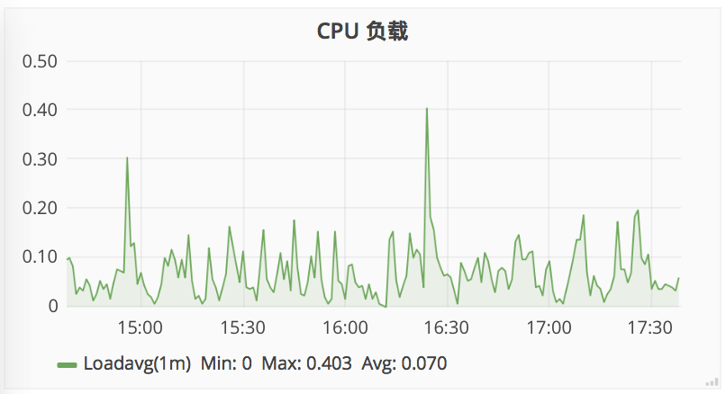

网络流量：突发流量，有没被攻击？请求量到达一定程度，网卡是否会成为瓶颈？

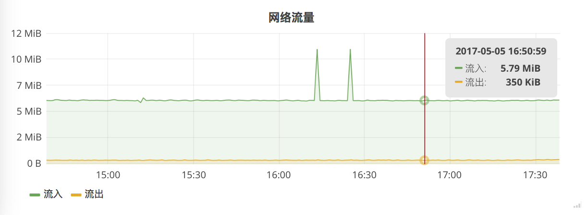

TCP连接状态：新增流量、TCP连接泄漏

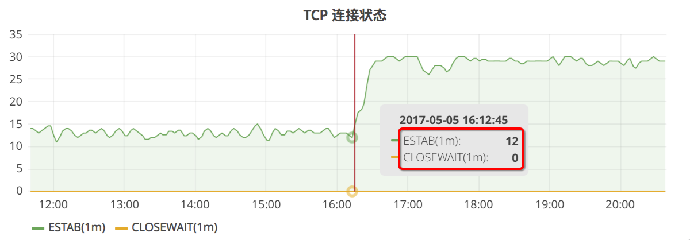

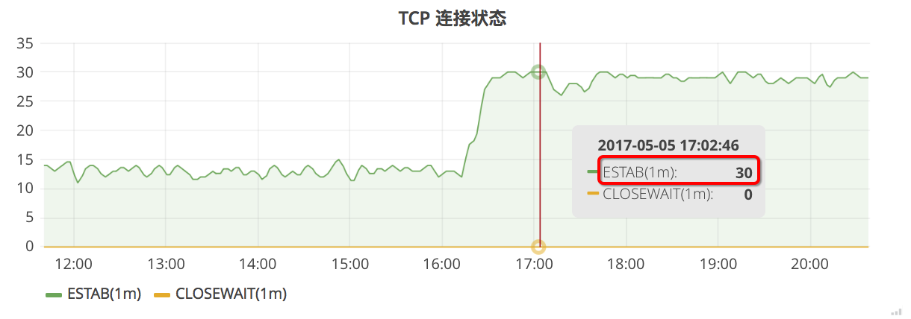

## 二、CPU
Processor load 1 min：最近一分钟系统的负载，值升高表示系统负载加大，请求量有没上升？

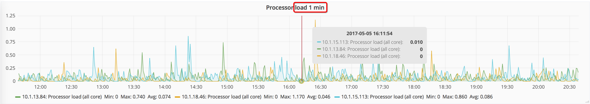

CPU system time：CPU系统时间

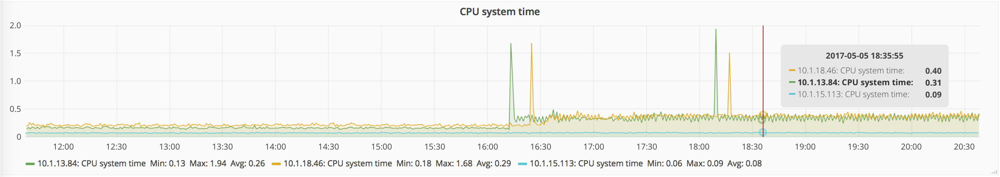

CPU iowait time：I/O等待时间
CPU user time：CPU用户时间，值很大时，GC是否过于频繁？

## 三、Process
Number of running process：JVM进程是否还在运行，0表示有可能是OOM导致进程被kill掉？

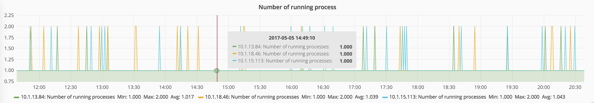

## 四、Memory
Available memory：内存逐渐减少，是不是存在内存泄漏？（部署新服务后下降了1GB）

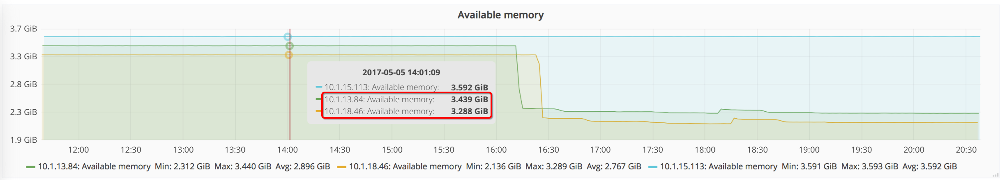

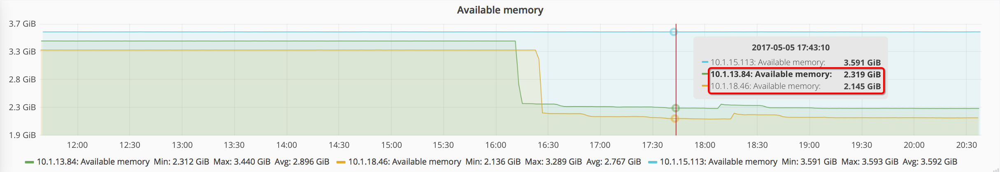

## 七、TCP Status
Established：增长表示新增请求量

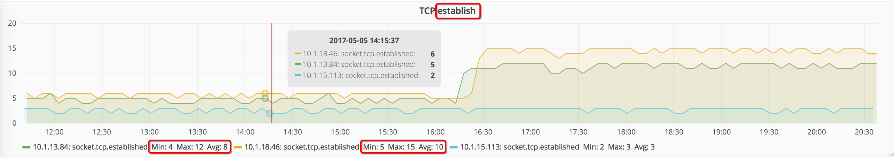

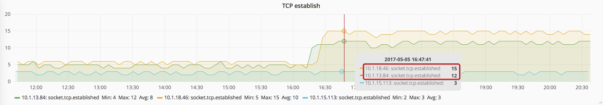

CloseWait：>0表示TCP连接泄漏

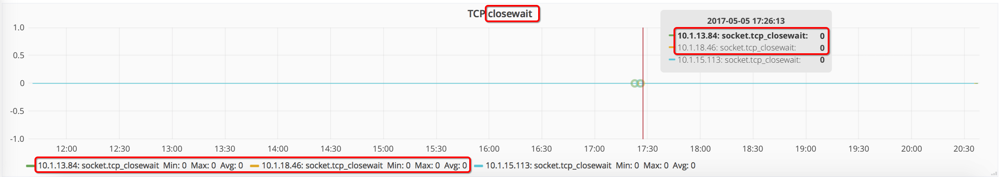

## 五、Network
Incoming network traffic：请求网络流量异常，查看是否有突发流量？

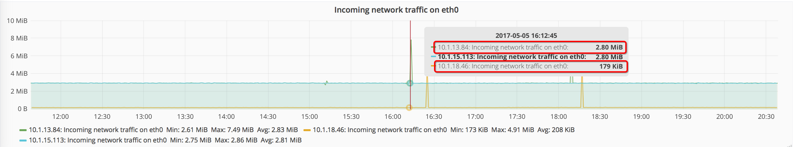

## 六、Disk
completed writes per second：I/O写异常，日志有没有打得太多？

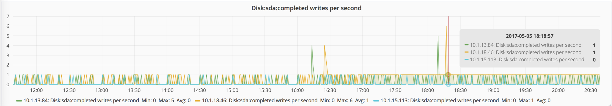

