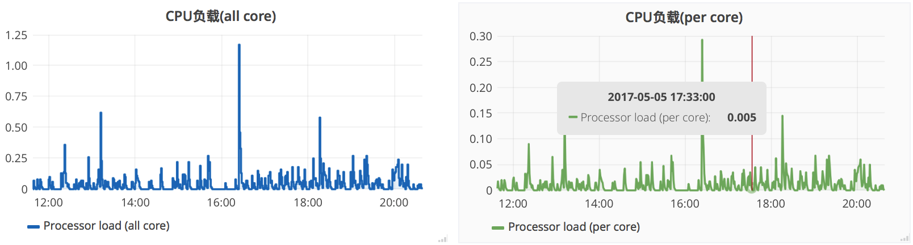
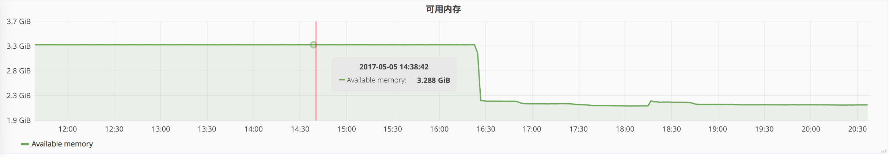
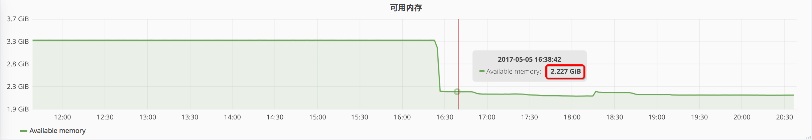
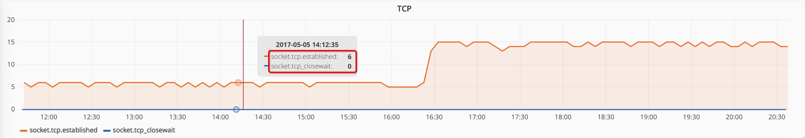
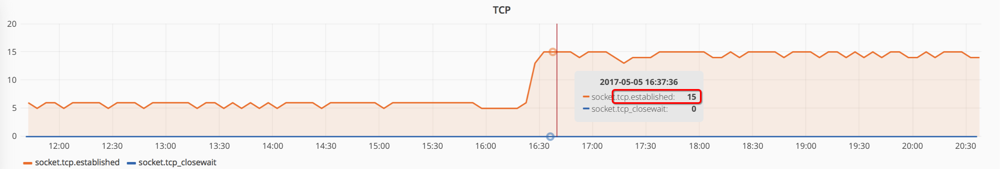

系统监控和业务监控本质是一样的，都是为了快速定位问题。
每个异常波动的指标都在说明一些问题，保持敏感性，应该定位其根源。

# Linux服务器指标监控之二
## 一、CPU - CPU时间占有率
CPU user time/用户时间：值很大时，GC是否过于频繁？

CPU负载：值升高表示系统负载加大，请求量有没上升？系统是否达到了瓶颈？

##### 二、内存
可用内存：内存一直逐渐减少，是否有内存泄漏？Minor GC是否正常回收内存？Minor GC运行频繁么？

##### 三、网络
网卡流量：突发流量，有没被攻击？请求量到达一定程度，网卡是否会成为瓶颈？

##### 四、磁盘IO
磁盘 All IO：I/O写异常，日志有没有打得太多？

##### 五、网络连接
TCP：Established增长表示新增请求量，CloseWait>0表示TCP连接泄漏

