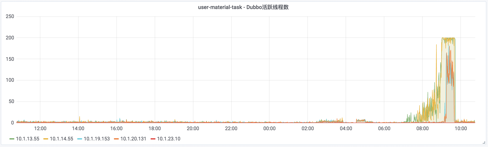
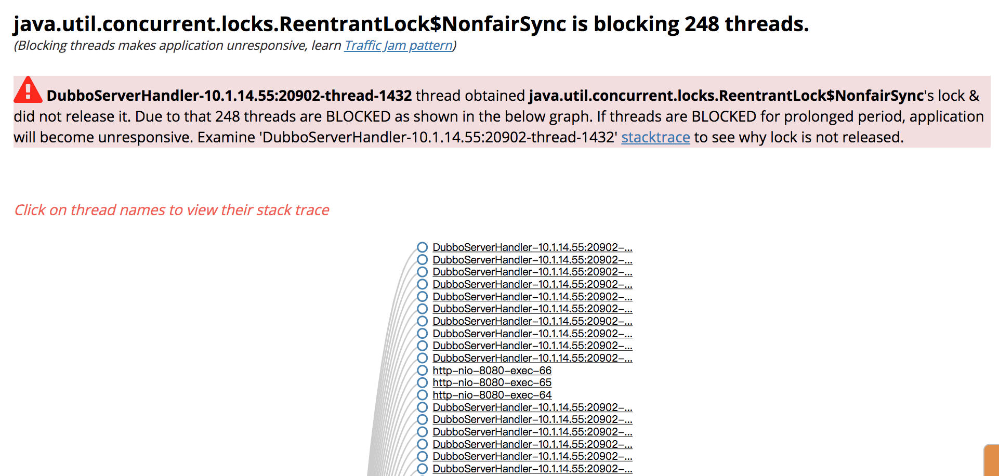
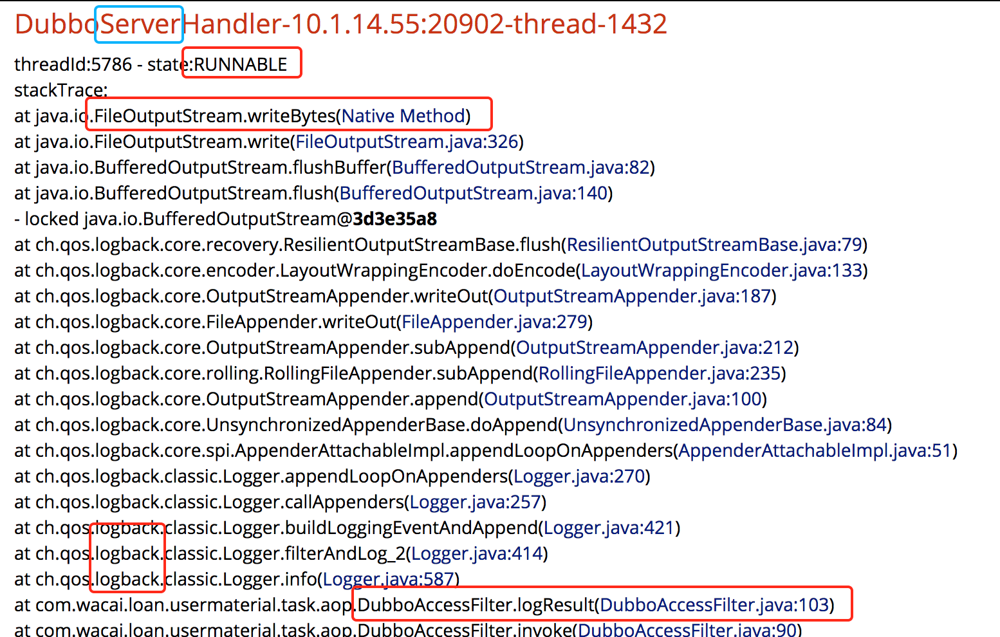
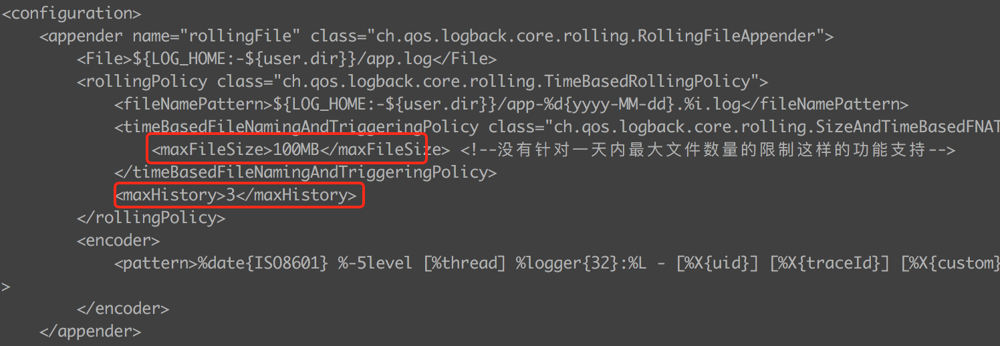
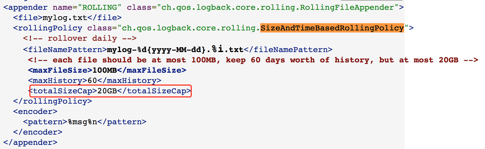

某应用服务因磁盘满卡住引起dubbo提供者线程数过多问题
===============================
> 2019-07-23


## 1.认识问题
大技术群里反馈，很多dubbo消费者服务出现超时异常，但不知道是哪些提供者服务处理慢引起。
用户资料服务`user-material-task`重启后，超时问题陆续恢复正常。

7月23日，今天上午共收到26条**Dubbo提供者线程数**告警通知，第一条告警是`08:45:08 user-material-task`，
前5条告警都是`user-material-task`应用，这波告警共涉及4个应用(`user-material-task, apply-root-provider, repayment-service-provider, goblin-loan`)。
**大概率怀疑是`user-material-task`应用引起**。

```
Dubbo提供者线程数@08:45:08:
user-material-task/xxx  dubbo 提供者线程数过多, 当前为 184  个, 最大限制为 200 个
<a href='https://xxx?task_id=38&user=xxx'>更多详情</a>

Dubbo提供者线程数@09:01:07:
user-material-task/xxx  dubbo 提供者线程数过多, 当前为 189  个, 最大限制为 200 个
<a href='https://xxx?task_id=38&user=xxx'>更多详情</a>
Dubbo提供者线程数@09:02:08:
user-material-task/xxx  dubbo 提供者线程数过多, 当前为 197  个, 最大限制为 200 个
user-material-task/xxx  dubbo 提供者线程数过多, 当前为 169  个, 最大限制为 200 个
<a href='https://xxx?task_id=38&user=xxx'>更多详情</a>
Dubbo提供者线程数@09:03:08:
user-material-task/xxx  dubbo 提供者线程数过多, 当前为 200  个, 最大限制为 200 个
user-material-task/xxx  dubbo 提供者线程数过多, 当前为 200  个, 最大限制为 200 个
<a href='https://xxx?task_id=38&user=xxx'>更多详情</a>
Dubbo提供者线程数@09:04:07:
user-material-task/xxx  dubbo 提供者线程数过多, 当前为 200  个, 最大限制为 200 个
<a href='https://xxx?task_id=38&user=xxx'>更多详情</a>

Dubbo提供者线程数@09:08:07:
apply-root-provider/xxx  dubbo 提供者线程数过多, 当前为 175  个, 最大限制为 200 个
apply-root-provider/xxx  dubbo 提供者线程数过多, 当前为 168  个, 最大限制为 200 个
<a href='https://xxx?task_id=38&user=xxx'>更多详情</a>
Dubbo提供者线程数@09:09:07:
apply-root-provider/xxx  dubbo 提供者线程数过多, 当前为 190  个, 最大限制为 200 个
apply-root-provider/xxx  dubbo 提供者线程数过多, 当前为 179  个, 最大限制为 200 个
apply-root-provider/xxx  dubbo 提供者线程数过多, 当前为 167  个, 最大限制为 200 个
apply-root-provider/xxx  dubbo 提供者线程数过多, 当前为 162  个, 最大限制为 200 个
<a href='https://xxx?task_id=38&user=xxx'>更多详情</a>
Dubbo提供者线程数@09:10:07:
user-material-task/xxx  dubbo 提供者线程数过多, 当前为 195  个, 最大限制为 200 个
apply-root-provider/xxx  dubbo 提供者线程数过多, 当前为 186  个, 最大限制为 200 个
apply-root-provider/xxx  dubbo 提供者线程数过多, 当前为 178  个, 最大限制为 200 个
apply-root-provider/xxx  dubbo 提供者线程数过多, 当前为 199  个, 最大限制为 200 个
apply-root-provider/xxx  dubbo 提供者线程数过多, 当前为 171  个, 最大限制为 200 个
<a href='https://xxx?task_id=38&user=xxx'>更多详情</a>
Dubbo提供者线程数@09:11:08:
apply-root-provider/xxx  dubbo 提供者线程数过多, 当前为 188  个, 最大限制为 200 个
user-material-task/xxx  dubbo 提供者线程数过多, 当前为 187  个, 最大限制为 200 个
apply-root-provider/xxx  dubbo 提供者线程数过多, 当前为 166  个, 最大限制为 200 个
<a href='https://xxx?task_id=38&user=xxx'>更多详情</a>

Dubbo提供者线程数@09:14:07:
apply-root-provider/xxx  dubbo 提供者线程数过多, 当前为 185  个, 最大限制为 200 个
<a href='https://xxx?task_id=38&user=xxx'>更多详情</a>
Dubbo提供者线程数@09:15:07:
apply-root-provider/xxx  dubbo 提供者线程数过多, 当前为 192  个, 最大限制为 200 个
<a href='https://xxx?task_id=38&user=xxx'>更多详情</a>
Dubbo提供者线程数@09:16:07:
apply-root-provider/xxx  dubbo 提供者线程数过多, 当前为 193  个, 最大限制为 200 个
repayment-service-provider/xxx  dubbo 提供者线程数过多, 当前为 161  个, 最大限制为 200 个
user-material-task/xxx  dubbo 提供者线程数过多, 当前为 163  个, 最大限制为 200 个
repayment-service-provider/xxx  dubbo 提供者线程数过多, 当前为 190  个, 最大限制为 200 个
<a href='https://xxx?task_id=38&user=xxx'>更多详情</a>
Dubbo提供者线程数@09:17:08:
repayment-service-provider/xxx  dubbo 提供者线程数过多, 当前为 186  个, 最大限制为 200 个
repayment-service-provider/xxx  dubbo 提供者线程数过多, 当前为 179  个, 最大限制为 200 个
apply-root-provider/xxx  dubbo 提供者线程数过多, 当前为 200  个, 最大限制为 200 个
goblin-loan/xxx  dubbo 提供者线程数过多, 当前为 242  个, 最大限制为 300 个
user-material-task/xxx  dubbo 提供者线程数过多, 当前为 165  个, 最大限制为 200 个
repayment-service-provider/xxx  dubbo 提供者线程数过多, 当前为 189  个, 最大限制为 200 个
repayment-service-provider/xxx  dubbo 提供者线程数过多, 当前为 182  个, 最大限制为 200 个
<a href='https://xxx?task_id=38&user=xxx'>更多详情</a>

Dubbo提供者线程数@09:18:08:
apply-root-provider/xxx  dubbo 提供者线程数过多, 当前为 200  个, 最大限制为 200 个
repayment-service-provider/xxx  dubbo 提供者线程数过多, 当前为 200  个, 最大限制为 200 个
repayment-service-provider/xxx  dubbo 提供者线程数过多, 当前为 169  个, 最大限制为 200 个
repayment-service-provider/xxx  dubbo 提供者线程数过多, 当前为 197  个, 最大限制为 200 个
apply-root-provider/xxx  dubbo 提供者线程数过多, 当前为 184  个, 最大限制为 200 个
repayment-service-provider/xxx  dubbo 提供者线程数过多, 当前为 182  个, 最大限制为 200 个
<a href='https://xxx?task_id=38&user=xxx'>更多详情</a>
Dubbo提供者线程数@09:19:08:
repayment-service-provider/xxx  dubbo 提供者线程数过多, 当前为 181  个, 最大限制为 200 个
repayment-service-provider/xxx  dubbo 提供者线程数过多, 当前为 193  个, 最大限制为 200 个
<a href='https://xxx?task_id=38&user=xxx'>更多详情</a>

Dubbo提供者线程数@09:22:08:
goblin-loan/xxx  dubbo 提供者线程数过多, 当前为 254  个, 最大限制为 300 个
<a href='https://xxx?task_id=38&user=xxx'>更多详情</a>
Dubbo提供者线程数@09:23:07:
apply-root-provider/xxx  dubbo 提供者线程数过多, 当前为 197  个, 最大限制为 200 个
<a href='https://xxx?task_id=38&user=xxx'>更多详情</a>
Dubbo提供者线程数@09:24:07:
user-material-task/xxx  dubbo 提供者线程数过多, 当前为 183  个, 最大限制为 200 个
<a href='https://xxx?task_id=38&user=xxx'>更多详情</a>
Dubbo提供者线程数@09:25:07:
repayment-service-provider/xxx  dubbo 提供者线程数过多, 当前为 185  个, 最大限制为 200 个
repayment-service-provider/xxx  dubbo 提供者线程数过多, 当前为 180  个, 最大限制为 200 个
<a href='https://xxx?task_id=38&user=xxx'>更多详情</a>
Dubbo提供者线程数@09:26:08:
repayment-service-provider/xxx  dubbo 提供者线程数过多, 当前为 190  个, 最大限制为 200 个
repayment-service-provider/xxx  dubbo 提供者线程数过多, 当前为 200  个, 最大限制为 200 个
user-material-task/xxx  dubbo 提供者线程数过多, 当前为 180  个, 最大限制为 200 个
<a href='https://xxx?task_id=38&user=xxx'>更多详情</a>

Dubbo提供者线程数@09:29:08:
user-material-task/xxx  dubbo 提供者线程数过多, 当前为 168  个, 最大限制为 200 个
<a href='https://xxx?task_id=38&user=xxx'>更多详情</a>
Dubbo提供者线程数@09:30:08:
user-material-task/xxx  dubbo 提供者线程数过多, 当前为 186  个, 最大限制为 200 个
<a href='https://xxx?task_id=38&user=xxx'>更多详情</a>
Dubbo提供者线程数@09:31:07:
user-material-task/xxx  dubbo 提供者线程数过多, 当前为 197  个, 最大限制为 200 个
user-material-task/xxx  dubbo 提供者线程数过多, 当前为 171  个, 最大限制为 200 个
<a href='https://xxx?task_id=38&user=xxx'>更多详情</a>

Dubbo提供者线程数@09:35:07:
goblin-loan/xxx  dubbo 提供者线程数过多, 当前为 246  个, 最大限制为 300 个
<a href='https://xxx?task_id=38&user=xxx'>更多详情</a>
Dubbo提供者线程数@09:37:08:
apply-root-provider/xxx  dubbo 提供者线程数过多, 当前为 200  个, 最大限制为 200 个
<a href='https://xxx?task_id=38&user=xxx'>更多详情</a>
Dubbo提供者线程数@09:38:09:
goblin-loan/xxx  dubbo 提供者线程数过多, 当前为 240  个, 最大限制为 300 个
apply-root-provider/xxx  dubbo 提供者线程数过多, 当前为 199  个, 最大限制为 200 个
apply-root-provider/xxx  dubbo 提供者线程数过多, 当前为 200  个, 最大限制为 200 个
<a href='https://xxx?task_id=38&user=xxx'>更多详情</a>
```


## 2.分析问题
`user-material-task/xxx`这个实例的用户根目录下`~/`发现第一个`Dubbo_JStack.log.2019-07-23_08:43:33`，通过分析线程调用栈发现Dubbo提供者线程都卡在`DubboAccessFilter.logResult(DubboAccessFilter.java:103)`同步写日志，再结合Grafana监控看到在上午7点钟时，该VM实例的磁盘已经满了。

Dubbo提供者线程数监控：



Grafana对机器实例的监控：**磁盘、CPU 都有异常，大概率是磁盘满了引起**


异常线程堆栈分析：





运维提供的统一logback配置有缺陷，最好配置`totalSizeCap`。`不然有可能由于一天日志打印太多，就把磁盘打满了。`





综上所述，**问题根源**是**应用打印很多日志，把VM实例磁盘打满了，进而卡住了logback日志写。**

