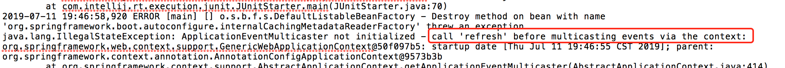
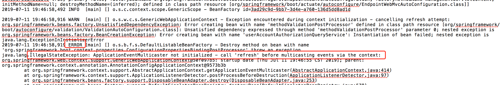
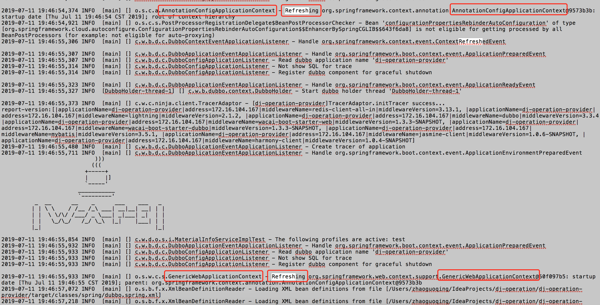

本机运行单元测试由多个Spring应用上下文导致应用启动异常
==============================
> 2019-07-26


## 1.认识问题
某同学反馈，“单农，能帮忙看一下这个本地启动报错见过吗？”

```
Caused by: java.lang.IllegalStateException: fail to create adaptive instance: java.lang.IllegalStateException: Can not create adaptive extenstion interface com.alibaba.dubbo.rpc.Protocol, cause: Failed to load extension class(interface: interface com.alibaba.dubbo.common.compiler.Compiler, class line: com.alibaba.dubbo.common.compiler.support.JavassistCompiler) in jar:file:/Users/zhaoguoqing/.m2/repository/com/xxx/dubbo/3.3.4/dubbo-3.3.4.jar!/META-INF/dubbo/internal/com.alibaba.dubbo.common.compiler.Compiler, cause: javassist/ClassPath
```

单农：完整的启动日志文件发我下。(见附件)


## 2.分析问题
通过启动日志发现，是跑`MaterialInfoServiceImplTest,selectById`的JUnit4单元测试，发现第一个异常如下。



下面的dubbo相关异常 ClassNotFoundException: javassist.ClassPath 是前面异常引起的。(排查问题要看第一个发生的异常)





**问题根源**是**存在启动两个不同的Spring应用上下文引起，父上下文为AnnotationConfigApplicationContext和子上下文为GenericWebApplicationContext。**
AnnotationConfigApplicationContext读取注解配置，GenericWebApplicationContext读取XML配置。
看着像是两个一起混用引起，你自己先尝试解决下哈。他后来没再找我

