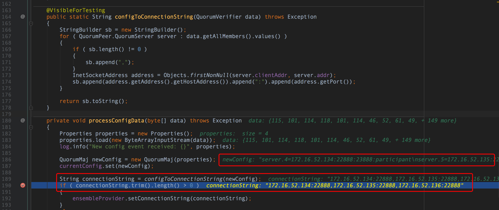
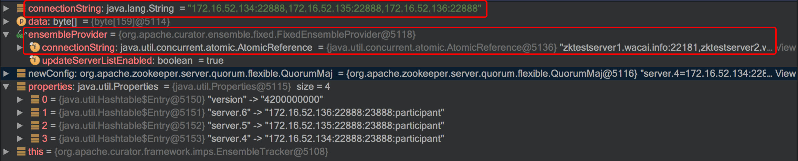

Curator-3.3.0在连接会话过期后connectString变为集群配置端口问题
============================================
> 2018-06-15


## 1.认识问题
某同学反馈，他们有个应用部署到 K2 环境，应用进程就不知怎么挂了，报了一堆 ZooKeeper 连不上的异常日志。

Curator 和 ZooKeeper JAR 版本：
```
curator-framework-3.3.0
zookeeper-3.5.1-alpha
```

详细日志（在本地 debug 复现）：
```java
2018-06-15 16:31:16.305 [main] [] INFO  org.apache.curator.framework.imps.CuratorFrameworkImpl - Starting
2018-06-15 16:31:16.330 [main] [] INFO  org.apache.zookeeper.ZooKeeper - Client environment:zookeeper.version=3.5.1-alpha-1693007, built on 07/28/2015 07:19 GMT
...
# 启动 ZK 客户端连接（connectString=zktestserver1.xxx.info:22181,zktestserver2.xxx.info:22181,zktestserver3.xxx.info:22181）
2018-06-15 16:31:16.344 [main] [] INFO  org.apache.zookeeper.ZooKeeper - Initiating client connection, connectString=zktestserver1.xxx.info:22181,zktestserver2.xxx.info:22181,zktestserver3.xxx.info:22181 sessionTimeout=60000 watcher=org.apache.curator.ConnectionState@79e7188e
# 打开套接字连接到服务器
2018-06-15 16:31:16.387 [main-SendThread(zktestserver2.xxx.info:22181)] [] INFO  org.apache.zookeeper.ClientCnxn - Opening socket connection to server zktestserver2.xxx.info/172.16.52.135:22181. Will not attempt to authenticate using SASL (unknown error)
# 套接字连接建立，启动会话
2018-06-15 16:31:16.413 [main-SendThread(zktestserver2.xxx.info:22181)] [] INFO  org.apache.zookeeper.ClientCnxn - Socket connection established, initiating session, client: /172.16.132.156:53406, server: zktestserver2.xxx.info/172.16.52.135:22181
2018-06-15 16:31:16.424 [main] [] INFO  org.apache.curator.framework.imps.CuratorFrameworkImpl - Default schema
# 会话在服务端建立完成
2018-06-15 16:31:16.474 [main-SendThread(zktestserver2.xxx.info:22181)] [] INFO  org.apache.zookeeper.ClientCnxn - Session establishment complete on server zktestserver2.xxx.info/172.16.52.135:22181, sessionid = 0x502742c2e6c17d7, negotiated timeout = 40000
# 连接状态改变（CONNECTED-连接上）
2018-06-15 16:31:16.485 [main-EventThread] [] INFO  org.apache.curator.framework.state.ConnectionStateManager - State change: CONNECTED
# 收到新的配置事件（设置客户端 connectString=172.16.52.134:22888,172.16.52.135:22888,172.16.52.136:22888）
2018-06-15 16:31:16.506 [main-EventThread] [] INFO  org.apache.curator.framework.imps.EnsembleTracker - New config event received: {version=4200000000, server.6=172.16.52.136:22888:23888:participant, server.5=172.16.52.135:22888:23888:participant, server.4=172.16.52.134:22888:23888:participant}
2018-06-15 16:31:16.511 [main] [] INFO  com.alibaba.dubbo.registry.zookeeper.ZookeeperRegistry -  [DUBBO] Register: dubbo://172.16.132.156:20880/com.xxx.boot.dubbo.api.DemoService?anyhost=true&application=xxx-boot-starters-indefinite-&application.group=dev-middleware-dannong&cellinvokemode=sharing&default.timeout=1000&dubbo=3.2.3&generic=false&interface=com.xxx.boot.dubbo.api.DemoService&logger=slf4j&methods=sayHello&pid=65859&side=provider&timestamp=1529051475626, dubbo version: 3.2.3, current host: 172.16.132.156
# 客户端会话超时，关闭套接字连接并尝试重新连接
2018-06-15 16:33:35.386 [main-SendThread(zktestserver2.xxx.info:22181)] [] INFO  org.apache.zookeeper.ClientCnxn - Client session timed out, have not heard from server in 138870ms for sessionid 0x502742c2e6c17d7, closing socket connection and attempting reconnect
# 打开套接字连接到服务器
2018-06-15 16:35:14.322 [main-SendThread(zktestserver1.xxx.info:22181)] [] INFO  org.apache.zookeeper.ClientCnxn - Opening socket connection to server zktestserver1.xxx.info/172.16.52.134:22181. Will not attempt to authenticate using SASL (unknown error)
# 客户端会话超时，关闭套接字连接并尝试重新连接
2018-06-15 16:35:14.472 [main-SendThread(zktestserver1.xxx.info:22181)] [] INFO  org.apache.zookeeper.ClientCnxn - Client session timed out, have not heard from server in 79647ms for sessionid 0x502742c2e6c17d7, closing socket connection and attempting reconnect
# 打开套接字连接到服务器
2018-06-15 16:35:22.258 [main-SendThread(zktestserver3.xxx.info:22181)] [] INFO  org.apache.zookeeper.ClientCnxn - Opening socket connection to server zktestserver3.xxx.info/172.16.52.136:22181. Will not attempt to authenticate using SASL (unknown error)
# 套接字连接建立，启动会话
2018-06-15 16:35:30.000 [main-SendThread(zktestserver3.xxx.info:22181)] [] INFO  org.apache.zookeeper.ClientCnxn - Socket connection established, initiating session, client: /172.16.132.156:53486, server: zktestserver3.xxx.info/172.16.52.136:22181
# 无法从服务器读取其他数据，可能服务器已关闭套接字，关闭套接字连接并尝试重新连接
2018-06-15 16:35:59.579 [main-SendThread(zktestserver3.xxx.info:22181)] [] INFO  org.apache.zookeeper.ClientCnxn - Unable to read additional data from server sessionid 0x502742c2e6c17d7, likely server has closed socket, closing socket connection and attempting reconnect
# 打开套接字连接到服务器
2018-06-15 16:36:02.741 [main-SendThread(zktestserver2.xxx.info:22181)] [] INFO  org.apache.zookeeper.ClientCnxn - Opening socket connection to server zktestserver2.xxx.info/172.16.52.135:22181. Will not attempt to authenticate using SASL (unknown error)
# 套接字连接建立，启动会话
2018-06-15 16:36:02.945 [main-SendThread(zktestserver2.xxx.info:22181)] [] INFO  org.apache.zookeeper.ClientCnxn - Socket connection established, initiating session, client: /172.16.132.156:53497, server: zktestserver2.xxx.info/172.16.52.135:22181
# 无法重新连接到ZooKeeper服务，会话已过期，关闭套接字连接
2018-06-15 16:36:09.847 [main-SendThread(zktestserver2.xxx.info:22181)] [] INFO  org.apache.zookeeper.ClientCnxn - Unable to reconnect to ZooKeeper service, session 0x502742c2e6c17d7 has expired, closing socket connection
# 连接字符串已更改为
2018-06-15 16:36:18.479 [main-EventThread] [] INFO  org.apache.curator.ConnectionState - Connection string changed to: zktestserver1.xxx.info:22181,zktestserver2.xxx.info:22181,zktestserver3.xxx.info:22181
# 连接状态改变（SUSPENDED-挂起）
2018-06-15 16:36:18.486 [main-EventThread] [] INFO  org.apache.curator.framework.state.ConnectionStateManager - State change: SUSPENDED
# 会话过期事件收到
2018-06-15 16:36:18.488 [main-EventThread] [] WARN  org.apache.curator.ConnectionState - Session expired event received
# 重新启动客户端连接（connectString=172.16.52.134:22888,172.16.52.135:22888,172.16.52.136:22888）
2018-06-15 16:36:18.489 [main-EventThread] [] INFO  org.apache.zookeeper.ZooKeeper - Initiating client connection, connectString=172.16.52.134:22888,172.16.52.135:22888,172.16.52.136:22888 sessionTimeout=60000 watcher=org.apache.curator.ConnectionState@79e7188e
# 连接状态改变（LOST-丢失）
2018-06-15 16:36:18.490 [main-EventThread] [] INFO  org.apache.curator.framework.state.ConnectionStateManager - State change: LOST
# 打开套接字连接到服务器
2018-06-15 16:36:18.491 [main-SendThread(172.16.52.136:22888)] [] INFO  org.apache.zookeeper.ClientCnxn - Opening socket connection to server 172.16.52.136/172.16.52.136:22888. Will not attempt to authenticate using SASL (unknown error)
# 会话的 EventThread 关闭
2018-06-15 16:36:18.491 [main-EventThread] [] INFO  org.apache.zookeeper.ClientCnxn - EventThread shut down for session: 0x502742c2e6c17d7
# 连接被拒绝
2018-06-15 16:36:18.501 [main-SendThread(172.16.52.136:22888)] [] WARN  org.apache.zookeeper.ClientCnxn - Session 0x0 for server null, unexpected error, closing socket connection and attempting reconnect
java.net.ConnectException: Connection refused
	at sun.nio.ch.SocketChannelImpl.checkConnect(Native Method)
	at sun.nio.ch.SocketChannelImpl.finishConnect(SocketChannelImpl.java:717)
	at org.apache.zookeeper.ClientCnxnSocketNIO.doTransport(ClientCnxnSocketNIO.java:355)
	at org.apache.zookeeper.ClientCnxn$SendThread.run(ClientCnxn.java:1236)
# 打开套接字连接到服务器
2018-06-15 16:36:18.605 [main-SendThread(172.16.52.135:22888)] [] INFO  org.apache.zookeeper.ClientCnxn - Opening socket connection to server 172.16.52.135/172.16.52.135:22888. Will not attempt to authenticate using SASL (unknown error)
2018-06-15 16:36:18.609 [main-SendThread(172.16.52.135:22888)] [] WARN  org.apache.zookeeper.ClientCnxn - Session 0x0 for server null, unexpected error, closing socket connection and attempting reconnect
java.net.ConnectException: Connection refused
	at sun.nio.ch.SocketChannelImpl.checkConnect(Native Method)
	at sun.nio.ch.SocketChannelImpl.finishConnect(SocketChannelImpl.java:717)
	at org.apache.zookeeper.ClientCnxnSocketNIO.doTransport(ClientCnxnSocketNIO.java:355)
	at org.apache.zookeeper.ClientCnxn$SendThread.run(ClientCnxn.java:1236)
# 打开套接字连接到服务器
2018-06-15 16:36:18.714 [main-SendThread(172.16.52.134:22888)] [] INFO  org.apache.zookeeper.ClientCnxn - Opening socket connection to server 172.16.52.134/172.16.52.134:22888. Will not attempt to authenticate using SASL (unknown error)
# 套接字连接建立，启动会话
2018-06-15 16:36:18.718 [main-SendThread(172.16.52.134:22888)] [] INFO  org.apache.zookeeper.ClientCnxn - Socket connection established, initiating session, client: /172.16.132.156:53502, server: 172.16.52.134/172.16.52.134:22888
# 报“连接丢失”异常
2018-06-15 16:36:19.482 [Curator-Framework-0] [] ERROR org.apache.curator.framework.imps.CuratorFrameworkImpl - Background operation retry gave up
org.apache.zookeeper.KeeperException$ConnectionLossException: KeeperErrorCode = ConnectionLoss
	at org.apache.zookeeper.KeeperException.create(KeeperException.java:99)
	at org.apache.curator.framework.imps.CuratorFrameworkImpl.checkBackgroundRetry(CuratorFrameworkImpl.java:814)
	at org.apache.curator.framework.imps.CuratorFrameworkImpl.performBackgroundOperation(CuratorFrameworkImpl.java:943)
	at org.apache.curator.framework.imps.CuratorFrameworkImpl.backgroundOperationsLoop(CuratorFrameworkImpl.java:895)
	at org.apache.curator.framework.imps.CuratorFrameworkImpl.access$300(CuratorFrameworkImpl.java:70)
	at org.apache.curator.framework.imps.CuratorFrameworkImpl$4.call(CuratorFrameworkImpl.java:314)
	at java.util.concurrent.FutureTask.run(FutureTask.java:266)
	at java.util.concurrent.ScheduledThreadPoolExecutor$ScheduledFutureTask.access$201(ScheduledThreadPoolExecutor.java:180)
	at java.util.concurrent.ScheduledThreadPoolExecutor$ScheduledFutureTask.run(ScheduledThreadPoolExecutor.java:293)
	at java.util.concurrent.ThreadPoolExecutor.runWorker(ThreadPoolExecutor.java:1142)
	at java.util.concurrent.ThreadPoolExecutor$Worker.run(ThreadPoolExecutor.java:617)
	at java.lang.Thread.run(Thread.java:745)
2018-06-15 16:36:19.483 [Curator-Framework-0] [] ERROR org.apache.curator.framework.imps.CuratorFrameworkImpl - Background retry gave up
org.apache.curator.CuratorConnectionLossException: KeeperErrorCode = ConnectionLoss
	at org.apache.curator.framework.imps.CuratorFrameworkImpl.performBackgroundOperation(CuratorFrameworkImpl.java:924)
	at org.apache.curator.framework.imps.CuratorFrameworkImpl.backgroundOperationsLoop(CuratorFrameworkImpl.java:895)
	at org.apache.curator.framework.imps.CuratorFrameworkImpl.access$300(CuratorFrameworkImpl.java:70)
	at org.apache.curator.framework.imps.CuratorFrameworkImpl$4.call(CuratorFrameworkImpl.java:314)
	at java.util.concurrent.FutureTask.run(FutureTask.java:266)
	at java.util.concurrent.ScheduledThreadPoolExecutor$ScheduledFutureTask.access$201(ScheduledThreadPoolExecutor.java:180)
	at java.util.concurrent.ScheduledThreadPoolExecutor$ScheduledFutureTask.run(ScheduledThreadPoolExecutor.java:293)
	at java.util.concurrent.ThreadPoolExecutor.runWorker(ThreadPoolExecutor.java:1142)
	at java.util.concurrent.ThreadPoolExecutor$Worker.run(ThreadPoolExecutor.java:617)
	at java.lang.Thread.run(Thread.java:745)
```

从日志上下文发现的现象，**ZK 收到新的配置事件**(`{version=4200000000,server.6=172.16.52.136:22888:23888:participant,server.5=172.16.52.135:22888:23888:participant,server.4=172.16.52.134:22888:23888:participant}`)，
**ZK 连接状态变为 SUSPENDED-挂起，然后收到会话过期事件，接着重新启动客户端连接(`connectString=172.16.52.134:22888,172.16.52.135:22888,172.16.52.136:22888`)，
连接状态变为 LOST-丢失，会话的 EventThread 关闭，连接被拒绝(Connection refused)，接着就一直报“连接丢失”异常(`ConnectionLossException: KeeperErrorCode = ConnectionLoss`)。**


## 2.分析问题
在本地 debug 看到 ZK 接收到`新的配置事件(New config event)`后的数据状态如下：





#### Curator 源代码
从源码走读看，收到新的配置事件后，其`connectString`会变为集群配置端口地址。

org.apache.curator.framework.imps.EnsembleTracker
```java
public class EnsembleTracker implements Closeable, CuratorWatcher
{

    private final ConnectionStateListener connectionStateListener = new ConnectionStateListener()
    {
        @Override
        public void stateChanged(CuratorFramework client, ConnectionState newState)
        {
            // CONNECTED
            if ( (newState == ConnectionState.CONNECTED) || (newState == ConnectionState.RECONNECTED) )
            {
                try
                {
                    reset();
                }
                catch ( Exception e )
                {
                    log.error("Trying to reset after reconnection", e);
                }
            }
        }
    };


    private void reset() throws Exception
    {
        if ( (client.getState() == CuratorFrameworkState.STARTED) && (state.get() == State.STARTED) )
        {
            BackgroundCallback backgroundCallback = new BackgroundCallback()
            {
                @Override
                public void processResult(CuratorFramework client, CuratorEvent event) throws Exception
                {
                    outstanding.decrementAndGet();
                    if ( (event.getType() == CuratorEventType.GET_CONFIG) && (event.getResultCode() == KeeperException.Code.OK.intValue()) )
                    {
                        // 处理配置数据
                        processConfigData(event.getData());
                    }
                }
            };
            outstanding.incrementAndGet();
            try
            {
                client.getConfig().usingWatcher(this).inBackground(backgroundCallback).forEnsemble();
                outstanding.incrementAndGet();  // finally block will decrement
            }
            finally
            {
                outstanding.decrementAndGet();
            }
        }
    }

    private void processConfigData(byte[] data) throws Exception
    {
        Properties properties = new Properties();
        properties.load(new ByteArrayInputStream(data));
        log.info("New config event received: {}", properties);

        QuorumMaj newConfig = new QuorumMaj(properties);
        currentConfig.set(newConfig);

        // connectString 被设置为集群配置端口(172.16.52.134:22888,172.16.52.135:22888,172.16.52.136:22888)
        // 问题伏笔
        String connectionString = configToConnectionString(newConfig);
        if ( connectionString.trim().length() > 0 )
        {
            ensembleProvider.setConnectionString(connectionString);
        }
        else
        {
            log.debug("Ignoring new config as it is empty");
        }
    }

    public static String configToConnectionString(QuorumVerifier data) throws Exception
    {
        StringBuilder sb = new StringBuilder();
        for ( QuorumPeer.QuorumServer server : data.getAllMembers().values() )
        {
            if ( sb.length() != 0 )
            {
                sb.append(",");
            }
            InetSocketAddress address = Objects.firstNonNull(server.clientAddr, server.addr);
            sb.append(address.getAddress().getHostAddress()).append(":").append(address.getPort());
        }

        return sb.toString();
    }
}
```

org.apache.curator.ensemble.fixed.FixedEnsembleProvider
```java
public class FixedEnsembleProvider implements EnsembleProvider
{
    @Override
    public String getConnectionString()
    {
        return connectionString.get();
    }
}
```

org.apache.curator.HandleHolder
```java
class HandleHolder
{
    String  getConnectionString()
    {
        return (helper != null) ? helper.getConnectionString() : null;
    }

    // 重新启动客户端连接时，会调用本方法获取新的连接字符串
    String getNewConnectionString()
    {
        String helperConnectionString = (helper != null) ? helper.getConnectionString() : null;
        return ((helperConnectionString != null) && !ensembleProvider.getConnectionString().equals(helperConnectionString)) ? helperConnectionString : null;
    }
}
```


## 3.解决问题
Connection loss not leading to ConnectionState.LOST and causing logs to fill
https://issues.apache.org/jira/browse/CURATOR-405

升级`curator-framework`版本到`4.1.0`。
```xml
    <dependency>
      <groupId>org.apache.curator</groupId>
      <artifactId>curator-framework</artifactId>
      <version>4.1.0</version>
    </dependency>
```

