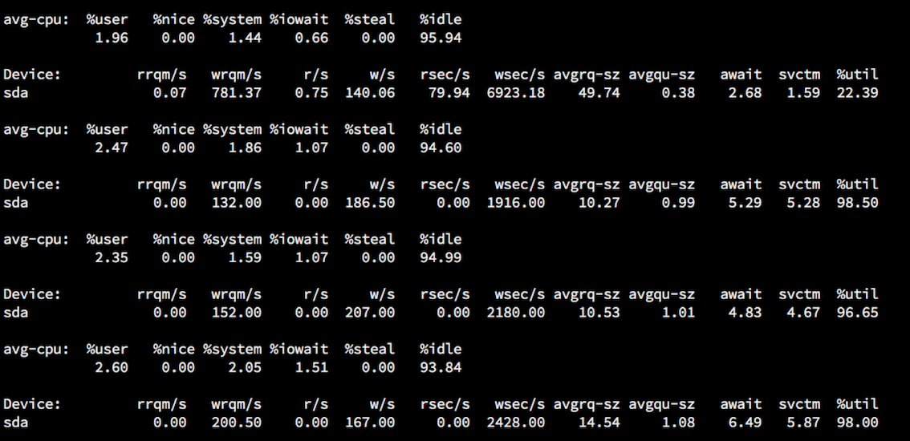
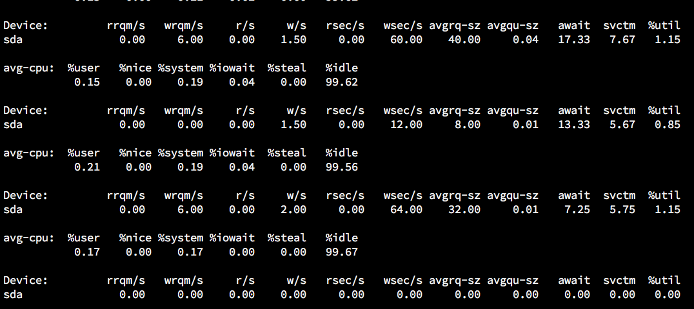

解决ZooKeeper占用IO过高的问题
====================
> GOOD21，2017-03-01

最近因为**Kafka集群**要接入新的topic，所以简单看看各种压力情况，发现`ZooKeeper占用IO过高`。

`iostat`如下图：

`iotop`如下图：

对比发现，`磁盘IO的频繁程度比较高，吞吐却不是很高`，ZooKeeper基本上稳定在400K/s。

### 1.为什么ZooKeeper会导致磁盘IO高？
`Kafka`的`Consumer`消费时，需要保存`offset`在ZooKeeper，而每一次的消费结束需要对`offset`做修改，
对于ZooKeeper来说，这是`一个事务`，所以每一次都要**落在磁盘**上才返回ok。

### 2.优化思路
ZooKeeper有两种日志，一种是`snapshot`（数据快照），另一种是`log`（事务日志），`出问题的点在于事务日志`。

1. 写内存，`/dev/shm`是系统内存划分出的一块区域，默认大小是系统内存的一半，可以通过`df -h`看到。我们可以把事务log写到这里
2. 单独mount一块SSD，这就不说了，是钱的问题。
3. 配置`forceSync=no`，是否需要在`事务日志`提交的时候调用`FileChannel.force`来保证数据完全同步到磁盘。
这个对写请求的性能提升很有帮助，是指每次写请求的数据都要从`PageCache`中固化到磁盘上，才算是写成功返回。
当写请求数量到达一定程度的时候，后续写请求会等待前面写请求的`forceSync`操作，造成一定延时。
如果追求**低延时的写请求**，配置`forceSync=no`，数据写到`PageCache`后就返回。
但是`机器断电`的时候，`PageCache`中的`数据有可能丢失`。

这里我最终选择的**写内存**的方式。

### 3.实施步骤
1. 修改`zoo.cfg`，把`事务日志`指向内存文件系统`dataLogDir=/dev/shm`
2. 重启`ZooKeeper`实例
3. 每个节点重复第一步和第二部

### 4.关于自动清理log
网上的文章都建议自己写`crontab`脚本去定时清理，我倒是觉得ZooKeeper提供的
配置参数`autopurge.snapRetainCount`和`autopurge.purgeInterval`已经很好用了。

**autopurge.snapRetainCount**：保存的快照日志和事务日志的分别的文件个数，默认`3`
**autopurge.purgeInterval**：清理的周期，0表示不开启，1表示每小时清理一次

### 5.效果

神清气爽~

[原文](https://www.good21.com/2017/03/01/fix-zookeeper-io/)

